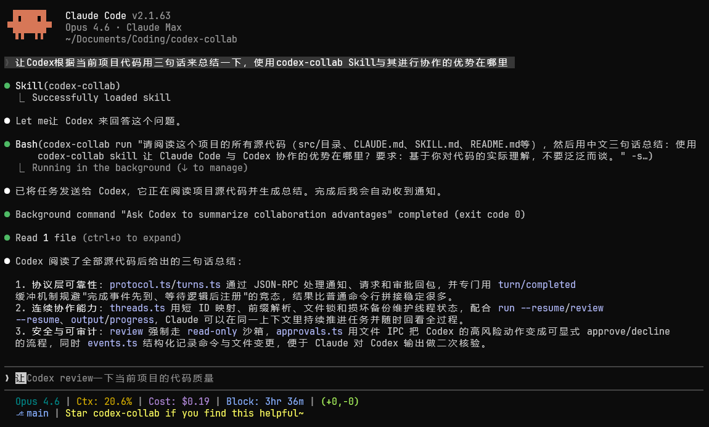

# codex-collab

[](https://github.com/Kevin7Qi/codex-collab/actions/workflows/ci.yml)
[](LICENSE)
[](https://bun.sh/)
[](https://www.typescriptlang.org/)

[English](README.md) | [中文](README.zh-CN.md)

在 [Claude Code](https://docs.anthropic.com/en/docs/claude-code) 中与 [Codex](https://github.com/openai/codex) 协作：派发任务、审查代码、并行研究，全程不用离开 Claude 会话。



codex-collab 是一个 [Claude Code 技能](https://docs.anthropic.com/en/docs/claude-code/skills)，借助 Codex app server 的 JSON-RPC 协议驱动 Codex：从会话的维护、结构化事件的实时推送，到工具调用的审批管控与对话恢复，全部在 Claude 会话内闭环完成。

## 核心优势

- **结构化通信**：与 Codex 之间通过 stdio JSON-RPC 通信，每个事件都有完整的类型定义，可解析、可追踪。
- **实时进度反馈**：Codex 工作时实时推送进度，Claude 随时掌握运行状态。
- **一键代码审查**：一条命令即可在只读沙箱中审查 PR、未提交更改或特定 commit。
- **会话复用**：接续先前的会话继续对话，在既有上下文基础上推进，不必从头开始。
- **审批控制**：按需为工具调用配置审批策略，可选自动批准、交互确认、拒绝，或交给 Codex 的 Guardian 自动审查（`--approval auto`）。
- **双向提问通道**：Codex 可在任务中途提问（`ask`），收到回答（`answer`）后继续执行；`next` 会持续等待，直到出现需要处理的事件。问题超时未获回答也不会阻塞任务，Codex 会自行判断并继续。
- **实时可观测**：`run --detach` 将长任务交给分离的运行进程；`follow --watch` 提供专门设计的实时视图，在终端分屏里持续跟踪每一次运行。
- **记忆隔离**：codex-collab 创建的会话默认不进入 Codex 的记忆功能，代理驱动的会话不会改变 Codex 对*你本人*工作方式的认知。可用 `--memory` 重新开启（详见选项说明）。

## 安装

需要 [Bun](https://bun.sh/) >= 1.0 和 [Codex CLI](https://github.com/openai/codex)（`npm install -g @openai/codex`）并加入 PATH。已在 Linux (Ubuntu 22.04)、macOS 与 Windows 10 上测试通过。

```bash
git clone https://github.com/Kevin7Qi/codex-collab.git
cd codex-collab
```

### Linux / macOS

```bash
./install.sh
```

### Windows

```powershell
powershell -ExecutionPolicy Bypass -File install.ps1
```

安装完成后运行 `codex-collab health` 验证。若提示找不到该命令，说明 `~/.local/bin` 尚未加入 PATH：可以重开终端、添加安装脚本打印的 export 语句，或直接使用完整路径 `~/.local/bin/codex-collab health`。

> [!TIP]
> 安装也可以交给智能体完成。在 Claude Code 之外运行（例如交给 Codex），下次启动 Claude 时技能即已就绪。过程中它会请求写入仓库以外目录的权限。

<details>
<summary>安装位置</summary>

安装脚本会构建一份独立 bundle 和一个可执行文件 shim。Linux 与 macOS 上分别放置于 `~/.claude/skills/codex-collab/` 和 `~/.local/bin`；Windows 上放置于 `%USERPROFILE%\.claude\skills\codex-collab\`，并由 `install.ps1` 将 shim 加入 PATH。

完成后 Claude 会自动发现该技能，正在运行中的会话同样生效。唯一的例外是首次安装技能：若 `~/.claude/skills/` 此前并不存在，需重启一次 Claude Code，新目录才会被监听。

</details>

### 升级

已安装的 codex-collab 可以自我更新，无需手动执行 `git pull`：

```bash
codex-collab update            # 显示最新版本及更新日志，确认后安装
codex-collab update --check    # 仅查看，不安装
```

`update` 会拉取最新版本，在本地重新构建并重装。任何安装动作都必须先获得同意：交互式终端中为 `y/N` 确认，无终端可询问时则需显式传入 `--yes`。存在新版本时，`run`、`review`、`health` 只会打印一行提示，绝不自行安装。

手动升级依然可行，也是开发模式安装（`install.sh --dev`）唯一的升级方式：

```bash
git pull
./install.sh    # Windows: powershell -ExecutionPolicy Bypass -File install.ps1
codex-collab health
```

<details>
<summary>升级的更多细节</summary>

`update --skip` 可屏蔽某个版本的提示，设置 `CODEX_COLLAB_NO_UPDATE_CHECK=1` 则完全关闭联网检查。本地的 SKILL.md 漂移检查无需联网，始终生效。

当已安装的 SKILL.md 与当前可执行文件或模板集不一致时，`codex-collab skill sync` 会先展示待应用的 diff，确认后写入。

两种升级方式都会替换 skill bundle 和可执行文件 shim。`~/.codex-collab/` 下的配置、模板、会话历史与运行日志均会保留。请将 `~/.claude/skills/codex-collab/` 视为安装脚本管理的目录，其中的手动修改可能在升级时被覆盖。

</details>

<details>
<summary>开发模式</summary>

使用 `--dev` 以符号链接方式安装，源码变更实时生效：

```bash
# Linux / macOS
./install.sh --dev

# Windows（可能需要启用开发者模式或使用管理员终端以创建符号链接）
powershell -ExecutionPolicy Bypass -File install.ps1 -Dev
```

</details>

## 快速开始

```bash
# 向 Codex 提问
codex-collab run "这个项目是做什么的？" -s read-only --content-only

# 代码审查
codex-collab review --content-only

# 恢复会话继续对话
codex-collab run --resume <id> "现在检查错误处理" --content-only

# 长任务：分离运行，在另一个终端分屏实时观看
codex-collab run "大规模重构" --detach --approval auto
codex-collab follow --watch
```

## CLI 命令

| 命令 | 说明 |
|------|------|
| `run "prompt" [opts]` | 新建会话、发送提示、等待完成并输出结果（`run -` 从标准输入读取提示词） |
| `review [opts]` | 代码审查（PR、未提交更改或指定 commit） |
| `threads [--json] [--all]` | 列出会话（`--discover` 扫描 app server，`--session` 只列当前会话期运行过的） |
| `follow [id]` | 在你自己的终端分屏中实时查看运行中的会话。不带 ID 时自动附着到活跃运行；`--watch` 会持续跟踪每一次新运行 |
| `output <id> [--last]` | 查看会话完整日志（`--last`: 只输出最近一轮的结果） |
| `kill <id> [--clear]` | 中断运行中的会话。若存在进行中的 goal 会先暂停；`--clear` 表示直接放弃 |

<details>
<summary>提问与审批</summary>

| 命令 | 说明 |
|------|------|
| `ask "question"` | 由 Codex 在任务中途调用，向协作者提问并等待回答。`--timeout <sec>` 设置等待时限（默认 600 秒）。超时不视为失败：会提示 Codex 自行判断并继续，随后以 0 退出 |
| `answer <id> "text"` | 回答待处理的问题（`answer <id> -` 从标准输入读取） |
| `questions [id]` | 列出当前工作区待处理的问题；带 ID 时显示完整内容 |
| `next` | 持续等待，直到出现需要处理的事件；完整打印内容及响应方式后退出 |
| `approve <id>` | 批准待处理的请求 |
| `decline <id>` | 拒绝待处理的请求 |

</details>

<details>
<summary>查看与配置</summary>

| 命令 | 说明 |
|------|------|
| `progress <id>` | 查看近期活动（日志尾部） |
| `peek <id>` | 从 app server 查看最近的会话片段 |
| `config [key] [value]` | 查看或设置持久化默认值 |
| `models` | 列出可用模型 |
| `templates` | 列出可用提示词模板 |

</details>

<details>
<summary>维护</summary>

| 命令 | 说明 |
|------|------|
| `delete <id> [--purge]` | 归档会话（可用 `codex unarchive` 恢复）并删除本地文件；`--purge` 则在服务端永久删除 |
| `clean` | 清理过期日志和失效映射 |
| `skill sync [--yes]` | 当已安装的 SKILL.md 与可执行文件或模板集不一致时重新生成。先打印 diff，确认后才写入 |
| `update` | 检查是否有新版本，确认后下载安装。详见[升级](#升级) |
| `health` | 检查依赖项与登录状态 |
| `version` | 打印版本号（也可在命令前使用 `-v`/`--version`） |

</details>

<details>
<summary>选项</summary>

**通用**

| 参数 | 说明 |
|------|------|
| `-d, --dir <path>` | 工作目录 |
| `-m, --model <model>` | 模型名称（默认: 自动选择最新可用模型） |
| `-r, --reasoning <level>` | none, minimal, low, medium, high, xhigh, max, ultra（默认: 自动选择模型支持的最高级别，上限为 `xhigh`） |
| `-s, --sandbox <mode>` | read-only, workspace-write, danger-full-access（默认: workspace-write）。`review` 不接受此参数：审查始终以 read-only 运行 |
| `--resume <id>` | 恢复已有会话 |
| `--approval <policy>` | 审批策略: never, on-request, on-failure, untrusted, auto（默认: never）。`auto`: Codex 的 Guardian 审查器自主批准或拒绝每个请求，绝不阻塞等待人工；决策以 Guardian 进度行的形式实时展示。`review` 不接受此参数：Codex 将审查子代理的审批策略锁定为 `never`，该参数不可能生效 |
| `--memory` | 允许 Codex 的记忆功能学习本次运行创建的会话。默认: 创建的会话会执行 `thread/memoryMode/set mode=disabled`；恢复的会话永不改动（该标记按会话持久保存，你自己创建的会话应继续进入你的记忆）。只作用于 Codex 的*本地*记忆整合（`~/.codex/memories`）；`personality` 属于显式用户配置（非学习所得），不受影响。持久化设置: `config memory true` |
| `--timeout <sec>` | 单轮超时时间，单位秒（默认: 1200，最大 2147483）。存在进行中的 goal 时，该时限约束整个 goal，超时会先暂停 goal 再退出。用于 `ask` 时为回答等待时限（默认 600）；用于 `next` 时为等待上限（默认无限期等待） |
| `--` | 选项结束标记；其后的参数一律视为提示词文本 |

**run**

| 参数 | 说明 |
|------|------|
| `--detach` | 在轮次真正开始运行后立即返回；用 `follow <id>` 观看。任务的生命周期与发起它的 shell 解耦 |
| `--template <name>` | 提示词模板（优先使用 `~/.codex-collab/templates/`，然后使用内置模板） |
| `--goal <objective>` | 在第一轮开始前为会话创建 goal（配合 `--resume` 时替换已有目标）；需要在 `~/.codex/config.toml` 中设置 `goals = true`。仍须提供 prompt：prompt 是第一轮的指令，goal 则是贯穿全程的目标。配合 `--template collab` 时，目标末尾会附加一行 ask 通道说明；由于目标文本会在每个后续轮次重新注入，这条说明在整个 goal 期间始终有效。`review` 不接受此参数：审查是临时会话上的单轮任务 |
| `--budget <tokens>` | `--goal` 的 token 预算。请预留充足余量：用量按每轮的完整上下文计算，即使很小的一轮也可能消耗约 6 万 token。`review` 不接受此参数 |
| `-` | 从标准输入读取提示词 |

**review**

| 参数 | 说明 |
|------|------|
| `--mode <mode>` | 审查模式: pr, uncommitted, commit, custom |
| `--ref <hash>` | 指定 commit 哈希（配合 `--mode commit`） |
| `--base <branch>` | PR 审查的基准分支（默认: 自动检测默认分支） |

**follow**

| 参数 | 说明 |
|------|------|
| `-w, --watch` | 运行结束后不退出，继续跟踪每一次新运行（Ctrl-C 停止） |

**skill 与 update**

| 参数 | 说明 |
|------|------|
| `--yes` | 跳过确认直接应用——供非交互式会话使用的显式同意标志 |
| `--check` | （update）仅显示最新版本及更新日志，不安装 |
| `--skip` | （update）屏蔽针对当前最新版本的更新提示；更新的版本发布后会再次提示 |

**列表与输出**

| 参数 | 说明 |
|------|------|
| `--json` | 对支持的命令输出 JSON（`threads`、`peek`） |
| `--all` | 列出全部会话，不限制显示数量 |
| `--discover` | 从 Codex app server 查询本地索引中没有的会话 |
| `--limit <n>` | 限制 `threads` 或 `peek` 显示的条目数 |
| `--full` | 在 `peek` 输出中包含所有条目类型（默认只显示消息） |
| `--content-only` | 隐藏进度输出；配合 `output` 时仅返回正文内容 |
| `--last` | （output）只输出最近一轮的结果，而非整个会话历史（隐含 `--content-only`） |
| `--session` | （threads）只列当前会话期运行过的会话 |

</details>

<details>
<summary>退出码</summary>

`run` 与 `review`：

| 退出码 | 含义 |
|--------|------|
| `0` | 完成 |
| `1` | 失败 |
| `3` | 超时；进行中的 goal 会先被暂停（可恢复） |
| `4` | 被中断（`kill`） |
| `5` | 因等待审批而中止；该审批请求已失效，请用更长的 `--timeout` 恢复，或改用 `--approval auto` |
| `6` | broker 占用且无可用回退；瞬态问题，可重试 |
| `7` | goal 因受阻或用量/预算达到上限而结束；用 `run --resume` 恢复并给出指引，或用 `kill --clear` 放弃 |

`next`：`0` 收到事件（内容完整打印到标准输出）、`3` `--timeout` 时限内没有事件、`10` 工作区空闲（没有运行中的任务，也没有待处理的事件）。

</details>

<details>
<summary>Goal 模式</summary>

在 `~/.codex/config.toml` 中设置 `goals = true` 后，goal（由 Codex 在任务中途自行创建，或用 `run "首轮指令" --goal "objective" [--budget <tokens>]` 显式设置）会让 app server 不断启动后续轮次，直到目标完成；`run` 会在同一份运行记录和日志中跟踪整个 goal，退出码反映 goal 的最终状态。目标文本会在每个后续轮次重新注入；内容较复杂的目标，可以改为指向仓库中的规格或计划文档。`threads` 会显示每个会话最新的 goal 状态（`[goal active: 45k/100k tokens]`）。

</details>

## 默认值与配置

默认情况下，codex-collab 自动选择**最新模型**（以 app server 的默认模型为起点，沿升级链向上查找，并在存在 `-codex` 变体时优先选用）及该模型支持的**最高推理级别，上限为 `xhigh`**。无需配置，新模型发布后自动更新。

`max` 与 `ultra` 两个级别不会被自动选中，需显式启用：单次运行使用 `-r max` / `-r ultra`，或通过 `codex-collab config reasoning` 设为默认值。

使用 `codex-collab config` 持久化覆盖默认值：

```bash
codex-collab config                     # 查看当前配置
codex-collab config model gpt-5.6-sol   # 设置默认模型
codex-collab config reasoning high      # 设置默认推理级别
codex-collab config model --unset       # 取消单个设置（恢复自动检测）
codex-collab config --unset             # 取消所有设置
```

可配置项: `model`、`reasoning`、`sandbox`、`approval`、`timeout`、`memory`

优先级: `CLI 参数 > 配置文件 > 自动检测`

配置存储于 `~/.codex-collab/config.json`。

## 参与贡献

欢迎贡献！开发环境搭建及贡献流程详见 [CONTRIBUTING.md](CONTRIBUTING.md)。本项目遵循 [Contributor Covenant](CODE_OF_CONDUCT.md) 行为准则。

## 相关链接

如果只需更轻量的交互，不妨试试官方的 [Codex MCP server](https://developers.openai.com/codex/guides/agents-sdk)。OpenAI 也提供了官方的 [Claude Code Codex 插件](https://github.com/openai/codex-plugin-cc)，以斜杠命令为主，需要你自行调用。codex-collab 要你做的更少：把需求用自己的话说给 Claude，它会在后台调用 Codex，再把结论带回给你。

感谢 [LINUX DO](https://linux.do/) 社区的反馈与支持。
