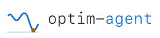
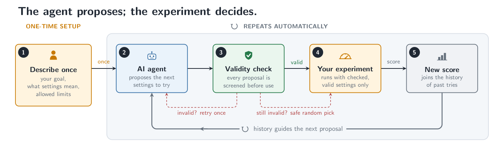
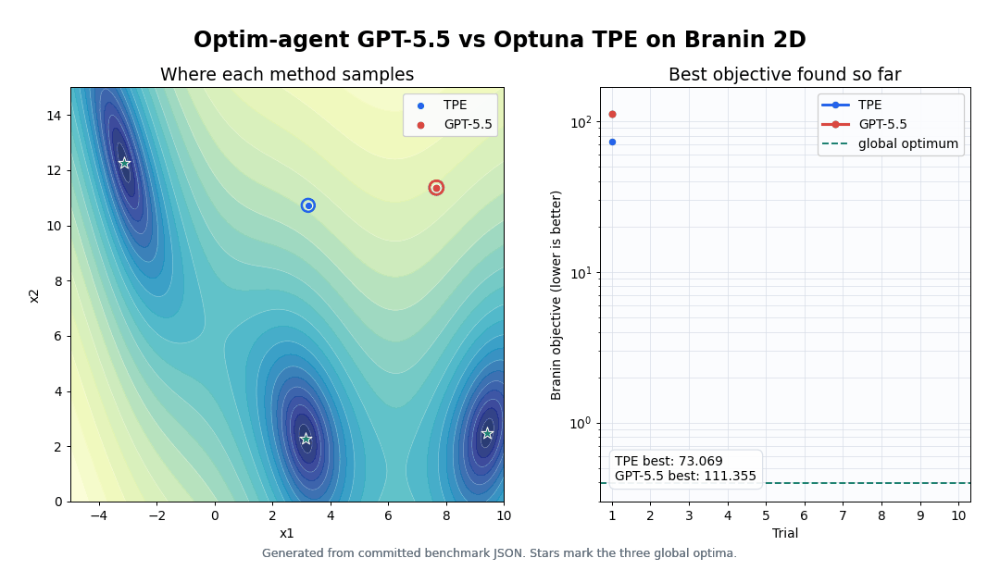
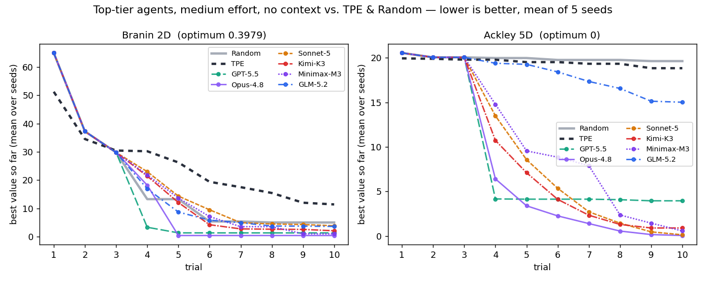
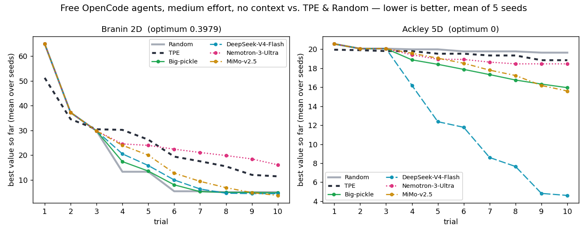
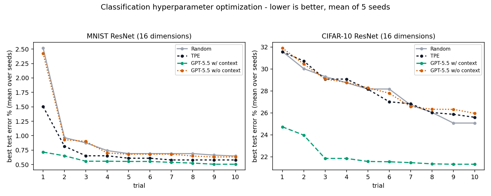
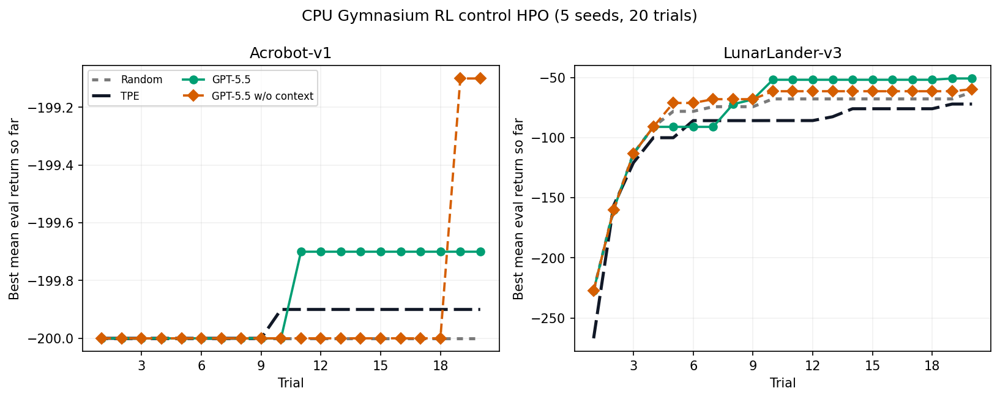
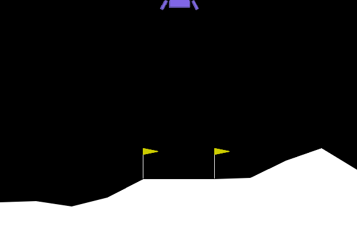
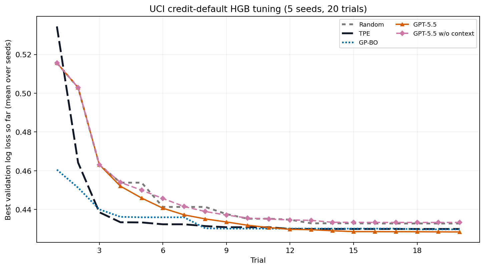

<p align="center">
  <picture>
    <source media="(prefers-color-scheme: dark)" srcset="../assets/optim-agent-logo-dark.svg">
    
  </picture>
</p>

<h1 align="center">optim-agent</h1>

<p align="center">
  <strong>코딩 에이전트로 수행하는 에이전트형 시스템 최적화.</strong><br>
  알고리즘 엔지니어의 반복적인 파라미터 튜닝 작업을 자동화합니다.
</p>

<p align="center">
  <a href="https://github.com/Optim-Agent/optim-agent/stargazers"></a>
  <a href="https://hits.sh/github.com/Optim-Agent/optim-agent/"></a>
  <a href="https://pypi.org/project/optim-agent/"></a>
  <a href="https://pypi.org/project/optim-agent/"></a>
  <a href="../../LICENSE"></a>
  <a href="https://optim-agent.github.io/optim-agent/"></a>
  <a href="https://code.claude.com/docs/en/skills"></a>
  <a href="https://developers.openai.com/codex/skills"></a>
</p>

<p align="center">
  <a href="../../README.md">English</a> |
  <a href="README_ZH.md">简体中文</a> |
  <a href="README_JA.md">日本語</a> |
  <strong>한국어</strong> |
  <a href="README_FR.md">Français</a> |
  <a href="README_DE.md">Deutsch</a> |
  <a href="README_ES.md">Español</a> |
  <a href="README_PT.md">Português</a> |
  <a href="README_RU.md">Русский</a>
</p>

optim-agent는 Claude Code / Codex / OpenCode가 실제 시스템 파라미터를 튜닝하도록 합니다.
코드를 읽고, trial을 제안하고, 측정된 objective 결과를 기록합니다. 설정 가능한 파라미터와
측정 가능한 objective가 있는 시스템에 적합합니다. 각 파라미터의 의미와 trial history가 보여주는
신호를 결합해 다음 평가 설정을 제안합니다. objective 평가는 항상 권위 있는 결과입니다.
optim-agent는 값을 제안하고, 선언된 공간에 대해 검증하고, 결과를 기록하며, 에이전트 응답이
유효하지 않으면 안전한 sampling으로 fallback합니다.

<p align="center">
  
</p>

| 모델 | 시스템 | 연구 |
|---|---|---|
| 학습, 아키텍처, RL 실험 | 추론, 지연 시간, 비용, 제어, 의사결정 규칙 | 정량 신호, 시뮬레이션, 과학 워크플로 |

## 주요 특징

- **의미 기반 제안** - 코딩 에이전트는 모든 차원을 익명 좌표로 보지 않고, 파라미터 의미와 문맥, 관측 결과를 함께 사용합니다.
- **작은 예산에서의 효과** - 평가가 비싸고 classical surrogate가 아직 데이터 부족인 상황에 유용합니다.
- **Agent CLI 개선 효과** - GPT-5.5에서 GPT-5.6으로 가는 것처럼 기반 코딩 에이전트가 좋아지면 최적화 코드를 바꾸지 않고도 제안 품질이 개선될 수 있습니다.
- **감사 가능한 결정** - JSON/SQLite study는 설정, 결과, 상태, 문맥, 선택적 에이전트 rationale을 보존합니다.
- **경계가 있는 실행** - 에이전트는 값만 제안하고 optim-agent가 선언된 공간으로 검증합니다. 잘못된 출력은 안전한 sampling으로 돌아갑니다.

## 설치

Codex skill 설치:

```text
$skill-installer install https://github.com/Optim-Agent/optim-agent
```

Claude Code plugin 설치:

```bash
claude plugin marketplace add Optim-Agent/optim-agent && claude plugin install optim-agent@optim-agent
```

Python 패키지 설치:

```bash
# PyPI 안정 버전
python -m pip install optim-agent

# GitHub 최신 소스
python -m pip install "optim-agent @ git+https://github.com/Optim-Agent/optim-agent.git"
```

`PATH`에 인증된 agent CLI가 하나 이상 필요합니다:
[claude](https://docs.anthropic.com/en/docs/claude-code),
[codex](https://github.com/openai/codex), 또는
[OpenCode](https://github.com/sst/opencode).

## 빠른 시작

```python
import optim_agent as oa

def objective(trial):
    threshold = trial.suggest_float(
        "threshold", 0.05, 0.95,
        context="decision threshold; higher values trade recall for precision",
    )
    budget = trial.suggest_int(
        "budget", 10, 200, log=True,
        context="compute or operating budget; larger values may improve quality",
    )
    return evaluate_system(threshold=threshold, budget=budget)  # domain code

study = oa.create_study(
    direction="maximize",
    sampler=oa.AgentSampler(
        backend="claude",  # or "codex" / "opencode"
        effort="high",
        context="maximize system quality under a strict operating-cost budget",
        history=5,
        explicit_reasoning=True,
        qualitative_notes=True,
    ),
    storage="study.json",  # optional: persist and resume
    summarize=True,  # optional: agent-written result summary after the last trial
)
study.optimize(objective, n_trials=20)
print(study.best_value, study.best_params)
print(study.summary)  # the summary agent's narration of the finished study
```

선택적 `context`는 study와 파라미터에 도메인 의미를 제공합니다.
`AgentSampler(context=...)`, `suggest_*(..., context=...)`, 또는 둘 다에 지정할 수 있습니다.

[`examples/quickstart.py`](../../examples/quickstart.py)를 실행하거나
[`tutorials/quickstart.ipynb`](../../tutorials/quickstart.ipynb)에서 단계별로 볼 수 있습니다.

## 적용 분야

| 영역 | optim-agent가 튜닝할 수 있는 파라미터 | objective 예시 |
|---|---|---|
| **모델 학습** | learning rate, architecture, augmentation, regularization | 검증 품질, 계산량, robustness |
| **추론과 서빙** | quantization, batching, decoding, caching, routing | 품질, latency, throughput, cost |
| **정량 연구** | signal window, threshold, rebalance rule, risk control | walk-forward return, drawdown, turnover |
| **강화학습과 의사결정** | objective weight, exploration schedule, environment setting, policy threshold | return, safety, sample efficiency |
| **과학 워크플로** | simulation input, solver setting, experimental control | fit, error, runtime, resource use |
| **블랙박스 시스템** | bounded categorical/integer/continuous configuration | scalar objective score |

추가 예시는 [`examples/sklearn_tuning.py`](../../examples/sklearn_tuning.py)와
[`examples/inference_tuning.py`](../../examples/inference_tuning.py)를 참고하세요.

강화학습에서 optim-agent는 learning loop 주변 시스템을 튜닝하며 policy-learning 알고리즘을 대체하지 않습니다.

## 최적화 궤적



이 seed-0 Branin trace는 같은 10-trial 예산에서 TPE와 GPT-5.5를 비교하고,
각 trial 이후의 incumbent objective를 보여줍니다. 궤적 설명용이며, 집계 benchmark 결과와 재현 명령은 아래에 있습니다.

### 문맥 없이 수학 함수 최적화: Branin-2D와 Ackley-5D

hard-function 에이전트는 **제공된 task context가 없습니다**. 일반 파라미터 이름 `x1...x5`,
수치 경계, trial history만 받습니다. 실행은 10 trials, 5 seeds를 사용하며 Random과 TPE는 고정 baseline입니다.

#### 상위 에이전트



| 방법 | mean best Branin ↓ | mean best Ackley-5D ↓ |
|---|---:|---:|
| Random | 5.008 | 19.639 |
| TPE | 11.395 | 18.843 |
| GPT-5.5 | 1.326 | 3.960 |
| **Opus-4.8** | **0.398** | **0.061** |
| Sonnet-5 | 3.850 | 0.143 |
| Kimi-K3 | 2.082 | 0.907 |
| Minimax-M3 | 0.970 | 0.574 |
| GLM-5.2 | 3.609 | 15.023 |

고정 모델은 `gpt-5.5`, `claude-opus-4-8`, `claude-sonnet-5`, `kimi-k3`,
`MiniMax-M3`, `glm-5.2`입니다.
Opus-4.8은 Branin optimum에 평균적으로 도달하고, five-seed Ackley mean도 가장 강합니다.

#### OpenCode 에이전트(무료)



| 방법 | mean best Branin ↓ | mean best Ackley-5D ↓ |
|---|---:|---:|
| Random | 5.008 | 19.639 |
| TPE | 11.395 | 18.843 |
| Big-pickle | 4.734 | 15.951 |
| **DeepSeek-V4-Flash** | 4.410 | **4.608** |
| Nemotron-3-Ultra | 16.051 | 18.459 |
| **MiMo-v2.5** | **3.682** | 15.597 |

OpenCode-hosted 모델은 유료 model API가 필요 없습니다. 무료 pool은 바뀔 수 있으므로 이번 refresh는
`opencode/big-pickle`, `opencode/deepseek-v4-flash-free`,
`opencode/nemotron-3-ultra-free`, `opencode/mimo-v2.5-free`를 고정합니다.
DeepSeek V4 Flash는 free-model Ackley mean이 가장 좋고, MiMo-v2.5는 free-model Branin mean이 가장 좋습니다.

### ResNet 기반 이미지 분류기 튜닝: MNIST와 CIFAR-10

분류 benchmark는 **Random**, Optuna **TPE**, **GPT-5.5 w/ context**,
**GPT-5.5 w/o context**를 5 seeds(`0..4`)와 10 trials로 비교합니다.
context 조건은 study와 parameter의 자연어 설명을 받고, no-context 조건은 bounds와 trial history만 받습니다.

주요 지표는 빠른 개선을 강조합니다:

```text
cumulative_best_so_far_error = sum(best_test_error_so_far_at_i for i in 1..10)
```

낮을수록 좋습니다.



| 방법 | MNIST cumulative error ↓ | MNIST final error ↓ | CIFAR-10 cumulative error ↓ | CIFAR-10 final error ↓ |
|---|---:|---:|---:|---:|
| Random | 9.174 | 0.648% | 278.920 | 25.072% |
| TPE | 7.166 | 0.580% | 279.936 | 25.596% |
| **GPT-5.5 w/ context** | **5.668** | **0.506%** | **220.994** | **21.322%** |
| GPT-5.5 w/o context | 8.910 | 0.632% | 281.466 | 25.960% |

GPT-5.5 w/ context는 TPE 대비 MNIST cumulative best-so-far error를 **20.9%** 줄였고,
Random 대비 CIFAR-10에서는 **20.8%** 줄였습니다. context가 없으면 MNIST에서는 TPE보다
24.3% 나쁘고, CIFAR-10에서는 Random보다 0.9% 나쁩니다.

[`examples/mnist.py`](../../examples/mnist.py)와 [`examples/cifar10.py`](../../examples/cifar10.py)는
learning rate, batch size, weight decay, label smoothing, 세 stage width, 세 stage depth,
네 dropout control을 튜닝합니다. MNIST는 translation과 rotation을 추가하고, CIFAR-10은 crop padding과 flip probability를 사용합니다.

### Q-learning controller 튜닝: Acrobot-v1과 LunarLander-v3



이 CPU-only Gymnasium benchmark는 Acrobot-v1과 LunarLander-v3의 discretized Q-learning controller를 튜닝합니다.
각 방법은 20 trials, 5 seeds(`0..4`)로 실행됩니다. objective는 mean evaluation return이므로 높을수록 좋습니다.
runner는 seed 사이와 각 HPO study 내부를 `--workers`로 병렬화합니다. GPT-5.5 arm은 high modeling effort와 최근 5 trials history를 사용합니다.

| 방법 | Acrobot-v1 return ↑ | LunarLander-v3 return ↑ |
|---|---:|---:|
| Random | -200.000 | -62.139 |
| TPE | -199.900 | -72.088 |
| **GPT-5.5 w/ context** | **-199.700** | **-50.825** |
| GPT-5.5 w/o context | -199.100 | -59.751 |

20 trials와 five-trial prompt history에서 GPT-5.5 w/ context는 두 환경 모두 가장 강한 mean return을 보였습니다.
Acrobot-v1에서는 TPE보다 0.2 높고, LunarLander-v3에서는 Random보다 11.3 높습니다.
이는 CPU HPO stress test이지 보편적 순위가 아닙니다.

애니메이션에서는 optim-agent가 하나의 HPO seed로 deterministic LunarLander controller의 7개 gain을 튜닝합니다.
각 trial은 같은 20 rollout seeds를 사용하고 성공 착륙 수를 우선한 뒤 mean return으로 고릅니다.
선택된 trial은 20개 rollout 모두 착륙에 성공했습니다.



### Gradient Boosting 분류기 튜닝: 신용 부도 확률



이 CPU-only benchmark는 UCI
[Default of Credit Card Clients](https://archive.ics.uci.edu/dataset/350/default+of+credit+card+clients)
dataset에서 `HistGradientBoostingClassifier`의 8개 training parameter를 튜닝합니다.
데이터는 30,000행, 23개 특성, next-month default target입니다. 공식 archive는 SHA-256으로 고정되어 있고
CC BY 4.0 license이며, 한 번만 60% train, 20% validation, 20% untouched test data로 나뉩니다.
모든 방법은 같은 split, 20 trials, seeds `0..4`를 사용합니다. 두 GPT-5.5 arm은 high modeling effort,
20 trials prompt history, explicit reasoning, qualitative notes를 사용합니다.

| 방법 | final validation log loss ↓ | held-out test log loss ↓ |
|---|---:|---:|
| Random | 0.433 | 0.425 |
| TPE | 0.430 | 0.422 |
| GP-BO | 0.430 | 0.423 |
| **GPT-5.5 w/ context** | **0.428** | **0.422** |
| GPT-5.5 w/o context | 0.433 | 0.427 |

context는 matched no-context control 대비 final validation log loss를 1.13%, test log loss를 1.23% 낮춥니다.
GPT-5.5는 Random, TPE, GP-BO보다 mean validation/test loss도 낮습니다. 유지할 configuration을 고를 때
validation과 test loss를 모두 사용했기 때문에 test result는 untouched generalization estimate가 아니라 benchmark comparison입니다.

이는 방법론 benchmark이며 production credit-decision system이 아닙니다. 배포에는 fairness, calibration, drift, governance, legal review가 필요합니다.

benchmark artifacts 재현:

```bash
pip install -e ".[examples]"

# Classification
python scripts/verify_classification_cumulative_error.py run-no-context
python scripts/verify_classification_cumulative_error.py

# Hard functions
python examples/hard_functions.py distributed \
  --agents Random TPE GPT-5.5 Opus-4.8 Sonnet-5 GLM-5.2 Big-pickle \
  DeepSeek-V4-Flash Nemotron-3-Ultra MiMo-v2.5 \
  --trials 10 --seeds 0 1 2 3 4
cp ~/.claude/settings-kimi.json ~/.claude/settings.json
python examples/hard_functions.py distributed --agents Kimi-K3 --trials 10 --seeds 0 1 2 3 4
cp ~/.claude/settings-minimax.json ~/.claude/settings.json
python examples/hard_functions.py distributed --agents Minimax-M3 --trials 10 --seeds 0 1 2 3 4
python examples/hard_functions.py plot

# Credit-card HGB
pip install -e ".[ml,examples]"
python examples/credit_card.py download
python examples/credit_card.py preflight
python examples/credit_card.py run
python examples/credit_card.py selfcheck
python examples/credit_card.py summary
python examples/credit_card.py plot

# RL control
pip install -e ".[rl,examples]"
python examples/rl_control.py preflight
python examples/rl_control.py run --seeds 0 1 2 3 4 --workers 10
python examples/rl_control.py selfcheck
python examples/rl_control.py summary
python examples/rl_control.py plot
python examples/rl_control.py gif
```

## 사용 가이드

### Sampler Prompt Controls

`effort`는 backend CLI의 reasoning-effort flag로 전달됩니다. harness prompt는 별도로 제어합니다:

```python
oa.AgentSampler(
    backend="codex",
    effort="medium",
    history=5,
    explicit_reasoning=True,
    qualitative_notes=True,
)
```

`history=None`은 완료/pruned trials를 모두 보여줍니다.
`explicit_reasoning=False` 또는 `qualitative_notes=False`로 에이전트 응답을 줄일 수 있습니다.

### Trial 로깅

`study.optimize(..., verbose=...)`는 trial별 출력을 제어합니다:

- `verbose=True`(기본값)는 대화형 터미널에서 표를 렌더링합니다: trial당 한 행에
  `trial`, `value`, `best`, `state` 열과 탐색 공간의 각 파라미터가 최초 등장 순서로
  한 열씩 표시됩니다. 긴 행은 터미널 너비에 맞게 말줄임표로 잘리고, 누락된 값
  (실패한 trial 등)은 `-`로 표시됩니다.
- stdout이 TTY가 아닐 때(파이프 출력, CI 로그) `verbose=True` / `"table"`은 자동으로
  grep 가능한 한 줄 형식으로 폴백합니다
  (`[optim-agent] trial 3: value=0.91 state=complete best=0.91`).
- `verbose="line"`은 TTY에서도 항상 한 줄 형식을 사용합니다.
- `verbose="table"`은 TTY에서는 표를, 파이프 시에는 한 줄 형식을 사용합니다.
- `verbose=False`는 trial별 출력을 끕니다.

define-by-run 공간에서는 새 파라미터 키를 도입하는 trial이 나타나면 열의 상위 집합으로
헤더 행을 다시 출력합니다.

### Summary Agent

`create_study`에 `summarize=True`를 전달하면 마지막 trial이 완료된 후 에이전트가
끝난 study를 한 번 서술합니다:

```python
study = oa.create_study(
    sampler=oa.AgentSampler(backend="claude"),
    storage="study.json",
    summarize=True,
)
study.optimize(objective, n_trials=20)
print(study.summary)  # JSON / SQLite 스토리지에도 저장됩니다
```

요약은 네 개의 섹션(최적 구성, 탐색 공간 인사이트, 궤적 하이라이트, 제안하는 다음 단계)으로
구조화됩니다. 터미널에 출력되고 `study.summary`에 저장됩니다(JSON 스토리지의 추가 키와
SQLite `meta` 테이블; 기존에 저장된 study는 `summary=None`으로 로드됩니다).

백엔드 해석: 명시적인 `summary_backend=`가 우선하고, 그렇지 않으면 sampler가
`AgentSampler`일 때 sampler의 backend를 재사용합니다. 다른 sampler에서는
`summary_backend=`를 전달하세요. 전달하지 않으면 `create_study`가 해결 방법을 알려주는
`ValueError`를 발생시킵니다. `summary_model=` / `summary_effort=`는 요약용으로
sampler의 model/effort를 재정의합니다. 네 섹션 모두로 파싱할 수 없는 에이전트 응답은
원문 텍스트 출력으로 폴백합니다. 요약은 study를 절대 실패시키지 않으며, 완료된
trial이 없는 study는 한 줄 안내와 함께 건너뜁니다. `backend="mock"`도 summarizer에서
동작하므로 데모와 테스트를 실제 agent CLI 없이 실행할 수 있습니다.

### Pruning

```python
study = oa.create_study(
    sampler=oa.AgentSampler(backend="codex"),
    pruner=oa.AgentPruner(
        backend="codex", level="medium", effort="medium",
    ),  # level: loose | medium | tight
)

def objective(trial):
    lr = trial.suggest_float("lr", 1e-5, 1e-1, log=True,
                             context="learning rate for training an image classifier")
    for epoch in range(20):
        loss = train_one_epoch(lr)
        trial.report(loss, epoch)
        if trial.should_prune():
            raise oa.TrialPruned()
    return loss
```

pruner agent는 현재 learning curve를 완료된 trials와 비교해 prune/keep을 답합니다.
`loose`는 명확히 부진한 run만 prune하고, `tight`는 더 공격적입니다. agent error는 trial을 prune하지 않습니다.

### Concurrency & Distributed Studies

`max_concurrency`(default `1`)를 설정해 여러 trial을 동시에 평가하고, SQLite `storage`
file(`.db` / `.sqlite`)을 concurrency-safe shared history로 사용할 수 있습니다:

```python
study = oa.create_study(
    sampler=oa.AgentSampler(backend="claude"),
    storage="study.db",        # SQLite -> safe for many workers; .json stays single-writer
    max_concurrency=8,         # up to 8 objectives run at once
)
study.optimize(objective, n_trials=100)
```

- **프로세스 내부**에서 `max_concurrency`는 thread pool로 objectives를 실행합니다.
  agent sampling query는 queue에서 직렬화되어 각 proposal이 process history를 봅니다. 병렬화되는 것은 objective call뿐입니다.
- **프로세스/머신 간**에는 모두 같은 SQLite `storage`를 가리키게 합니다.
  database가 통신 channel이며 WAL mode로 write conflict 없이 결과 추가와 history read가 가능합니다.

제한: thread는 GIL을 공유하므로 pure-Python CPU-bound objective는 shared SQLite storage와 별도 process가 더 좋습니다.
concurrent worker는 서로의 in-flight point를 보지 못해 가까운 영역을 탐색할 수 있습니다.

### 스킬 모드(Agent가 프로젝트 코드를 읽음)

pip package는 objective를 black box로 취급합니다.
[optim-agent skill](../../SKILL.md)은 코딩 에이전트 세션에서 먼저 **프로젝트를 읽어**
각 파라미터의 역할을 이해한 뒤 `study.ask(params)` / `study.tell(trial, value)`로 같은 study loop를 실행합니다.
study JSON은 세션 간 history를 유지합니다.

```text
$skill-installer install https://github.com/Optim-Agent/optim-agent
```

Claude Code plugin:

```bash
claude plugin marketplace add Optim-Agent/optim-agent
claude plugin install optim-agent@optim-agent
```

Codex plugin:

```bash
codex plugin marketplace add Optim-Agent/optim-agent
codex plugin add optim-agent@optim-agent
```

```python
trial = study.ask({"threshold": 0.72, "budget": 80})
study.tell(trial, evaluate_system(**trial.params))
```

### Offline Testing

`AgentSampler(backend="mock")`은 token-free stand-in이며 best point 주변에서 hill climbing합니다.
agent call 전에 integration을 테스트하는 데 적합합니다.

## 문제 해결

- **agent session 안에서 `claude`가 401을 반환** - nested session은 `ANTHROPIC_API_KEY`를 상속합니다.
  `env -u ANTHROPIC_API_KEY` 또는 clean shell에서 실행하세요.
- **backend call이 timeout 또는 invalid output을 냄** - sampler가 경고하고 해당 trial을 random point로 fallback합니다. study는 계속 진행됩니다.
- **OpenCode with distributed studies** - OpenCode currently does not support distributed computing
  in optim-agent; single-process workflow 또는 다른 backend를 사용하세요.

## 기여

로컬 개발:

```bash
pip install -e ".[examples]"
pytest                     # runs tests/test_optim_agent.py
```

큰 변경은 PR 전에 issue로 논의해 주세요. 새 agent backend 추가는 보통
[`optim_agent/agent.py`](../../optim_agent/agent.py)에 작은 함수 하나를 추가하는 정도입니다.

영문 [`README.md`](../../README.md)가 version, benchmark values, backend list의 기준입니다.

## 감사의 말

- [Optuna](https://github.com/optuna/optuna)는 Study/Trial interface를 대중화했고,
  examples와 benchmarks 전반에서 쓰는 TPE baseline을 제공했으며, 실용 optimization tooling의 기준을 세웠습니다.
- [OpenCode](https://github.com/sst/opencode)는 hard-function benchmarks에서 평가한 free model 접근을 제공했습니다.

## 라이선스

[MIT](../../LICENSE)
