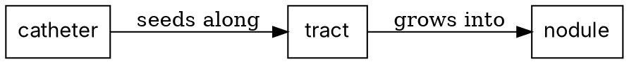

# Present-Paper Skill

## Purpose

Prepare a polished academic presentation from a research paper. The skill walks through a 5-phase
pipeline: paper analysis, supporting research, script writing, slide note injection, and Q&A
preparation.

Use it when:

- preparing a journal club or seminar presentation
- presenting a paper for a graduate course
- preparing grand rounds or conference talks based on a published paper
- building speaker notes for an existing slide deck

---

## Communication Rules

- Communicate with the user in their preferred language.
- Use English for medical, statistical, and methodological terminology.
- Add pronunciation guides for drug names and technical abbreviations in the user's language.
- Be direct about paper limitations, but frame them constructively.

---

## Phase 0: Init & Outline

### Step 0a — Load design references (read before drafting outline)

Three of these are read **now**, in full — they change what you produce. The rest are read **when the
answer to Q0 tells you which one you need**, because a talk has one venue and one style, and reading
the others costs roughly seven thousand tokens to learn nothing you will use.

**Read now (always):**

**A. `references/ai_slide_tells.md`** — the marks a generated deck leaves. Read all of it, first.
The complaint about AI decks is **not** that they are ugly — templates solved ugly. It is that they
*stop communicating*, because they were built to make the maker comfortable rather than to serve the
audience. This file is why the deck does not need catching later; `scripts/check_slide_tells.py`
catches it after (Step 3.6). It **overrules older guidance where they conflict** — in particular the
eyebrow-on-every-slide and brand-footer rules this project used to mandate, which are the single
most-cited visual tell.

**B. `references/presentation_archetypes.md`** — the **skeleton**, chosen by where the speaker is
standing: conference oral, journal-club critique, case-anchored grand rounds, didactic lecture,
defence, keynote (Duarte's sparkline, the Jobs STAR moment, Takahashi/Lessig), lay talk, decision
brief (Minto's pyramid, action titles, Kawasaki's 10/20/30). A deck has **two independent choices**
and conflating them is why talks fail: the *archetype* is what the talk has to **do**; the *visual
style* is what it **looks like**. A conference oral in a keynote's skeleton dies (no data on the
slides); a keynote in a conference oral's skeleton dies harder. **The skin is a preference; the
skeleton is not.** Its mechanical half is `scripts/check_deck_budget.py`.

**C. `references/presentation_design_guidelines.md`** — the enforceable rules (assertion headlines,
24-pt floor, negative space, ≤3 colours, colourblind-safe palettes, redraw-don't-screenshot,
animation discipline) plus the G1–G10 self-check the Phase 3.5 critic scores against.

**Read on demand — after Q0/Q2 tell you which one:**

| File | Read it when | Cost if read blindly |
|---|---|---|
| `references/medical_presentation_templates.md` | the venue is one of the five medical ones — then read **that section only** | ~3,700 tokens, of which you use a fifth |
| `references/slide_visual_styles/CATALOG.md` → one style file | Q2 has chosen a style | ~2,300 tokens per style |
| `references/slide_design_principles.md` | you are stuck on *why* a slide is not landing — Reynolds / Duarte / Knaflic / Tufte, the theory under the rules in **C** | ~2,600 tokens of theory you mostly already applied |

These mirror the entry-point pattern used in
`make-figures/references/design_principles.md` (Step 1 "Specify"). Both skills share
the same Reynolds / Knaflic / Tufte foundations — slide-level (this skill) and
figure-level (make-figures) are companions, not duplicates.

### Required Inputs

Before starting, collect these from the user:

| Input | Why |
|-------|-----|
| **Paper** | PDF path, DOI, or PMID |
| **Presentation time** | Determines depth and slide count |
| **Target audience** | Specialty mix, knowledge level — controls terminology depth |
| **Context** | Course name, conference, journal club format, prior session topics |
| **Template / visual style** | Institutional template (.pptx/.potx) to fill, or a visual style to generate in. Default: ask (Step 0b) |
| **Extension section** | Optional topic to include (e.g., AI directions, clinical implications). Default: none |

### Step 0b — Template & visual style selection

After collecting the inputs above and **before** drafting the outline, settle how the
deck will look. Ask the user two questions (use `AskUserQuestion`; skip a question if the
user already answered it in their request):

**Q0 — "Where are you standing, and for how long?"** (venue + minutes)

This decides the **archetype** — the skeleton — before any question about looks. Map the answer with
the selector table in `references/presentation_archetypes.md`, and carry `archetype` + `minutes`
forward: Step 3.6 checks the built deck against them. A 40-word slide is an ordinary academic slide
and a catastrophic keynote slide; there is no universal answer to "how much text is too much", only
an answer for *this room*.

If the user gives only a topic and no venue, **ask**. Do not guess: a deck built for no particular
room comes out generic in exactly the way every reviewer can see.

**Q1 — "Do you have an institutional or branded template to use?"**
- **Yes** → the user supplies a `.pptx`/`.potx`. Switch to **Mode C** (Phase 3, "Fill an
  institutional template"): run `scripts/inspect_pptx_template.py <file>` to list its
  layouts/placeholders/theme, then fill by placeholder index, preserving the master and
  logo. See `references/slide_visual_styles/institutional_brand.md`. Do **not** also ask
  Q2 — the template's theme *is* the style.
- **No / none** → ask Q2.

**Q2 — "Which visual style should I generate in?"** Offer the `CATALOG.md` menu with a
one-line preview each (make the recommended option first and label it):

| Option | One-line preview |
|--------|------------------|
| **Nature / Lancet** *(recommended for medical academic talks)* | White, navy + coral accent, hairline dividers, Inter/Pretendard — restrained editorial-academic |
| **Clinical Blue** | White/light-blue, navy-teal, calm and trustworthy, colorblind-safe — grand rounds / CME |
| **Editorial Mono** | High-contrast black-on-white, oversized type, one accent — single big-message keynote |
| **Dark Modern** | Deep-slate background, off-white text, electric accent — AI / method / tech talks |
| **Other** | Describe a palette/feel, or name a journal/brand to emulate |

Record the choice; pass the matching style spec to Phase 3. If the user has no
preference and the talk is a medical academic talk, default to **Nature / Lancet**
(`~/.claude/rules/academic-lecture-style.md`). Style choice does not change the outline,
script, or Q&A — only Phase 3 rendering.

**Q3 — conference decks only: is slide 1 a submission requirement?** Many societies require the
title slide to carry the title, authors, affiliations and country **exactly as entered in the
abstract submission**. Those fields are not yours to improve. A crowded title slide is a real
temptation to shorten an affiliation to its institution, and doing so breaks the requirement while
satisfying the density check — which is the one place in this skill where a gate and a rule point in
opposite directions. **The requirement wins.** Read the fields off the submission portal, copy them,
and record `SLIDE_TOO_DENSE` on slide 1 as consciously overruled with that reason.

### Paper Analysis

Read the paper and produce a structured analysis:

```text
## Paper Analysis

### Citation
[Full citation with DOI]

### Background
- What gap does this paper address?
- What was known vs. unknown before this study?

### Study Design
- Type: [RCT / cohort / case series / meta-analysis / etc.]
- Subjects: [n, inclusion/exclusion]
- Methods: [key methodological choices]
- Primary outcome: [what was measured]

### Key Results
1. [Finding 1 with effect size and CI/p-value]
2. [Finding 2]
3. [Finding 3]

### Patient/Case Summary Table
[If applicable — structured table of individual cases or subgroups]

### Limitations
1. [Limitation 1]
2. [Limitation 2]

### Significance
- Why does this matter?
- What changes because of this paper?
```

### Slide Outline

Create a slide-by-slide outline with time allocation:

```text
## Slide Outline ([N] slides, [M] minutes)

| # | Title | Time | Key Content |
|---|-------|------|-------------|
| 1 | Title slide | 0:30 | Paper citation, presenter |
| 2 | Context / Prior sessions | 1:00 | How this connects to prior knowledge |
| 3 | Background | 1:30 | The gap this paper fills |
| ... | ... | ... | ... |
| N | Take-home messages | 0:30 | 3-5 key points |
```

**Gate: User approves outline before proceeding.**

---

## Phase 1: Supporting Research

### Search Strategy

Find references that strengthen the presentation:

1. **Follow-up studies** — Has the main finding been replicated or extended?
2. **Clinical trial data** — Large-scale data that contextualizes the findings
3. **Review articles** — Authoritative summaries that frame the topic
4. **Contradicting evidence** — Important for balanced Q&A preparation

**Efficiency rule:** Limit supporting references to 5-8 total. Only search categories
that the approved outline (Phase 0) actually requires. Skip categories not needed for
the presentation type (e.g., skip clinical trials for a methods-focused paper).

### Selection Criteria

Do NOT summarize every paper found. Extract only:

- Specific data points needed for slides (incidence rates, OR/HR, AUC values)
- Findings that directly support or challenge the main paper
- Context that helps the audience understand significance

### Output

```text
## Verified References

### Main Paper
1. [Citation] — PMID: XXXXX, DOI: XX.XXXX/XXXXX

### Supporting References
2. [Citation] — PMID: XXXXX
   → Used for: [specific data point or context]
3. [Citation] — PMID: XXXXX
   → Used for: [specific data point or context]

### Key Data for Slides
- [Statistic 1]: [value] — Source: [Ref #]
- [Statistic 2]: [value] — Source: [Ref #]
```

**Every reference must have a verified DOI or PMID. Mark unverified references with [UNVERIFIED].**

---

## Phase 2: Script & Content

### Speaker Script

Draft a complete speaker script with these requirements:

1. **Language**: User's preferred language for narration; English for technical terms
2. **Audience adaptation**: Adjust explanation depth based on Phase 0 audience profile
   - For mixed audiences: add one-line plain-language explanations for specialty-specific terms
   - Example: "FLAIR sequence — an MRI technique that suppresses fluid signal to highlight edema"
3. **Pronunciation guide**: Include native-language pronunciation for drug names, abbreviations
   - Example: "lecanemab (leh-KAN-eh-mab)" or local equivalent
4. **Timing markers**: Note approximate time per slide
5. **Transition phrases**: Connect each slide to the narrative arc

### Structure

```text
## Speaker Script

### Slide 1: Title (0:30)
"[Opening — introduce yourself and the paper]"

### Slide 2: Context (1:00)
"[Connect to prior knowledge or clinical relevance]"

...

### Slide N: Take-home Messages (0:30)
"[Summarize 3-5 key points. Thank audience. Invite questions.]"
```

### Extension Section (Optional)

Only include if user requested in Phase 0. Examples:

- AI/computational research directions stemming from the paper
- Clinical practice implications
- Policy or guideline implications
- Connections to the user's own research

**Gate: User reviews script before proceeding.**

---

## Phase 3: Slides & Notes

### Three Modes

**Mode A** = generate a new deck in a chosen visual style. **Mode B** = add notes to an
existing deck. **Mode C** = fill the user's institutional/branded template (chosen at
Step 0b). Pick the mode from the Step 0b answer.

**Mode A: Generate new slide deck**

Generate a fully-editable PPTX from structured inline data using `python-pptx`. Two
canonical template libraries:

- `${CLAUDE_SKILL_DIR}/references/generate_pptx_templates.py` — generic T_lead /
  T_text / T_table / T_image_right / etc. templates with smoke-tested `main()`. Use
  for journal club, grand rounds, conference talk, and short paper talks.
- `${CLAUDE_SKILL_DIR}/templates/build_pptx_nature_lancet.py` — Nature/Lancet visual
  style (white + navy + coral, Inter/Pretendard, 47-slide academic lecture proven).
  Use for **academic lecture multi-paper survey** (template #5). Functions:
  `new_presentation`, `add_title_slide`, `add_toc_slide`, `add_section_divider`,
  `add_transition_slide`, `add_content_slide`, `add_glossary_slide`,
  `add_closing_slide`, plus `fix_app_xml()` helper. Style spec:
  `references/slide_visual_styles/nature_lancet.md`.

For lecture decks pulling figures from PDFs (rather than from `/make-figures`
output), use `${CLAUDE_SKILL_DIR}/scripts/extract_pdf_figures.py` — pdftoppm + PIL
crop with normalized (0–1) box coordinates. Supports both single-crop CLI and YAML
batch config.

After raw extraction, run `${CLAUDE_SKILL_DIR}/scripts/trim_caption.py` to
**auto-remove journal headers / figure captions / surrounding whitespace** so
that only the figure body remains — the Adobe-Acrobat-crop equivalent in
automation. The script uses horizontal-projection segmentation plus
text-band detection (height + density + gap + line-pattern signature) and
preserves multi-panel figures intact:

```bash
python3 "${CLAUDE_SKILL_DIR}/scripts/trim_caption.py" \
  --in-dir  figures/extracted \
  --out-dir figures/cropped
```

Handles four common journal layouts: top running-head bar, bottom multi-line
caption (sparse text), bottom caption *fused* with figure body (no clear gap,
detected via narrow dark/light alternation), and multi-row tables with
footnotes (footnote cut, table rows preserved). No tesseract / OCR
dependency — Pillow + numpy only. Verified on 12-figure academic deck
(80–95% height retention; captions, journal banners, and CellPress-style
headers all removed). When the deck slot expects only the figure body
(default for `build_pptx_nature_lancet.py`), point `FIG_DIR` at the cropped
output dir.

### Word-boundary aware markdown parser (mandatory for HLA-rich decks)

When the build script parses inline `**bold**` / `*italic*` markers in slide
body or speaker notes, the italic rule must use **word-boundary lookahead /
lookbehind** so asterisk-bearing scientific tokens (HLA alleles like
`DRB1*07:01`, `HLA-A*02:01`, SNP IDs, footnote markers) are not eaten as
italic delimiters:

```python
import re
pattern = re.compile(
    r"(\*\*(?:(?!\*\*).)+?\*\*"                           # bold; inner single * allowed
    r"|(?<![A-Za-z0-9])\*[^*\n]+?\*(?![A-Za-z0-9]))"      # italic (word-boundary)
)
```

Two regex tricks together:
1. **Italic with boundary**: `(?<![A-Za-z0-9])` and `(?![A-Za-z0-9])` reject
   `*` adjacent to alphanumerics, so `DRB1*07:01` is left intact.
2. **Bold tolerates inner single `*`**: `(?:(?!\*\*).)+?` allows
   `**DRB1*04:02**` (HLA allele inside bold) to match as a single bold span.

Without these, a naive `\*[^*]+\*` italic pattern silently corrupts every
HLA allele in the deck. Add the regex to `add_styled()` (or equivalent) in
every Nature/Lancet-style build script.

### Pronunciation auto-augment for non-native presenters

For decks where the presenter is uncomfortable with English pronunciation of
acronyms, author names, drug names, or gene symbols, append a per-slide
`[ Pronunciation ]` section to the speaker notes (audience sees nothing —
only Presenter View). Use
`${CLAUDE_SKILL_DIR}/scripts/inject_pronunciation_notes.py`:

```bash
python3 "${CLAUDE_SKILL_DIR}/scripts/inject_pronunciation_notes.py" \
  input.pptx output.pptx \
  --dict pron_dict.yaml \
  --header "[ 발음 ]"            # or any header you like
```

The script:
- Loads a YAML/JSON `PRON_DICT` (term → [reading, full_name]) supplied by
  the caller. The dict is domain-specific — assemble it for your audience
  (Korean readings, French readings, Spanish readings, etc.).
- Uses **word-boundary regex** `(?<![A-Za-z0-9_]) … (?![A-Za-z0-9_])` so
  short acronyms (e.g. `AE`, `OR`) only match when standalone, never inside
  other words.
- Recognizes allele-style tokens via a separate regex
  (`\b(?:HLA-)?[A-Z]{1,5}[0-9]?\*[0-9]{2}:[0-9]{2}\b` by default) and
  synthesizes their reading from the base allele entry in the dict.
- Skips slides that already contain the header (idempotent — safe to re-run).

Realistic yield on a 47-slide academic deck: ~38 slides receive a section,
~300 total term entries, 5–10 per annotated slide. Transition and divider
slides have empty notes and are auto-skipped.

### Speaker notes statistics density

When the slide body already shows exact OR / 95% CI / p-value, the notes
should NOT repeat the same numbers — the presenter ends up reading
statistics aloud and the audience cannot keep up. Notes should be a
**narrative** (key anchors + one-line "see the slide body for the exact
numbers" reminder), not a numeric listing.

Quick measurement to spot dense slides during QC:

```python
import re
text = slide.notes_slide.notes_text_frame.text.split(pron_header)[0]
n_char = len(text)
n_stat = len(re.findall(r"\b(?:OR|p|CI)\s*[=<>]?\s*\d|\d+\.\d+|\d+%|×10", text))
needs_compression = n_char > 1000 and n_stat >= 5
```

Rule of thumb: 700–1,000 chars + 0–2 stat tokens is fine (30–60-second
narrative). >1,000 chars + ≥5 stat tokens → compress to narrative tone and
point at the slide body. Exact numbers belong in the slide body and
footnotes (SSOT), not the notes.

### Numbers in the notes are numbers you will say out loud

Everything the rest of this toolkit enforces about figures in the slide body applies to the notes,
because the notes are what the speaker reads at the microphone. Two failures, both observed:

- **A quoted benchmark typed from memory.** "95% of 152 models were rated high risk" — the source
  said 87%, of 148 of 171; a second note said "98% of 62 oncology models" where the source said 84%
  and 62 was the number of *papers*, not models. The papers were cited correctly in the reference
  list. Only the digits were remembered. **Every external number in the notes is checked against the
  source, exactly like a number in the body.**
- **An injected value hand-typed during a rewrite.** When a build script draws numbers from an
  artifact — `f"{N['primary']}"` — compressing the prose is where they get flattened into literals.
  Twelve of them went that way in one 14-minute-to-9-minute pass. The slide body was gated and the
  notes were not, so the deck would have said one number while the speaker said another. **When you
  edit generated text, the count of injection expressions must not fall.** Before and after:

```python
import re
len(re.findall(r"\{N\[", src))   # must not decrease across a rewrite
```

Pull the hand-typed numbers out for checking with the same regex, inverted — anything numeric that
is *not* inside an injection expression is a literal somebody typed.

### Sharing-ready notes-stripped variant

After the presentation, when the deck is shared with the audience (e.g. a
professor asking for the slides), the speaker notes typically contain
presenter-only material — second-language narrative, pronunciation hints,
self-referential reminders ("Prof. ○○ will likely ask about …"). Stripping
notes is mandatory before circulation. Use
`${CLAUDE_SKILL_DIR}/scripts/strip_notes_for_sharing.py`:

```bash
python3 "${CLAUDE_SKILL_DIR}/scripts/strip_notes_for_sharing.py" \
  presenter_v9.pptx share/<topic>_<initials>.pptx
```

The script:
- Clears every slide's `notes_text_frame` (idempotent, slide body and
  figures untouched).
- Re-writes `docProps/app.xml` with the correct `Slides=` and `Notes=`
  counts so PowerPoint Mac does not show its repair dialog (see also the
  app.xml canonical fix in `pptx-mac-compatibility.md` §5).
- Verifies that zero notes characters remain.

Recommended 3-file sharing package (filename pattern `<topic>_<initials>`):
- `<topic>_<initials>.pptx` — notes-stripped variant for slide reuse
- `<topic>_<initials>.pdf` — same deck, PDF for environment-agnostic
  preview (LibreOffice `--convert-to pdf` automatically drops the cleared
  notes pages)
- `<topic>_<initials>_references.zip` — optional bundle of the reference
  PDFs; if it exceeds the email attachment limit, send a Google Drive link.

In the cover email, mention the PPTX is included specifically so the
recipient can reuse individual slides if useful.

### The companion documents leave with the deck — check them too

`_qa_prep.md`, `_quick_review.md` and any handout are drafted from the same working material as the
notes, and they travel further. Three things to check before any of them goes out:

- **Retired numbers.** A gate on the deck is not a gate on its siblings. In one talk the slides said
  26.3% and the last-minute review sheet still said 54.1% — the deck was right and the document the
  speaker would answer questions from was wrong, which is the worse way round. Sweep the sibling
  `.md` files for the superseded values whenever the deck's numbers move. Where an old figure is
  deliberately quoted, fence it (`<!-- superseded-quotation -->`) rather than exempting the file.
- **Operator material in an audience document.** A brief written to prepare *you* for a meeting
  carries the register it was written in — "the point they will push back on", "the fallback
  position", a minute-by-minute plan. Handed to the person it describes, it reads as a strategy for
  managing them. When one document has to serve both purposes, it is two documents: an internal one
  with the contingencies, and a neutral one with the findings and what you are asking them to
  confirm. This is the same rule as stripping the speaker notes, applied to the files beside them.
- **Live-only devices, and what points at them.** A redistributed deck is read at a desk, not
  attended: a break slide, a timer, "as we just saw in the exercise" mean nothing there, and another
  speaker's break is their own decision. Remove them — **and then grep the whole deck, bodies and
  notes, for the sentences that referred to them**, because those are left dangling by the deletion.
  While you are there, re-verify anything the material asserts about an upstream project (install
  commands, counts, versions) against that project's own source rather than against the copy you
  wrote months ago: an exact number with a date stays accurate longer than a vague one, which drifts
  silently and cannot be checked.

### Architecture

```
inline structured data (lists/dicts in build_*_slides())
    ↓ template functions (T_lead / T_text / T_table / ...)
editable PPTX with native text frames (selectable, restyleable in PowerPoint)
```

Three rules that keep slides stable:

1. **No markdown parsing.** Every slide is a function call with explicit inline data.
2. **No `cur_top` cumulative position tracking.** Use the fixed coordinate zones below — `cur_top` accumulates rounding errors and breaks layout after ~10 slides.
3. **No Marp.** Marp renders to images; the deck becomes uneditable and reviewers cannot copy text or restyle.

### Slide-type templates

| Template | Use for | Required fields |
|----------|---------|-----------------|
| `T_lead` | Title slide, section divider | `title`, `subtitle?`, `extra?` |
| `T_text` | Bullet body (most common) | `title`, `body_lines[]`, `subtitle?` |
| `T_table` | Cohort tables, comparisons | `title`, `headers[]`, `rows[][]`, `body_before?` |
| `T_image_right` | Body + figure on right | `title`, `body_lines[]`, `img_path`, `img_pct?` (PNG ≥300dpi or vector PDF — see Figure source formats below) |
| `T_quote_slide` | Verbatim citations, witness quotes | `title`, `quotes[]`, `body_after?`, `img_path?` |
| `T_two_col` | Compare/contrast | `title`, `left_lines[]`, `right_lines[]` |
| `T_two_col_with_box` | Compare + emphasis | as above + `metaphor_col`, `metaphor_lines[]` |
| `T_highlight_slide` | Single key result | `title`, `highlight_lines[]`, `body_before?` |
| `T_metaphor_body` | Body + analogy footer | `title`, `body_lines[]`, `metaphor_lines[]` |
| `T_table_two_col` | Take-aways + numeric table | `title`, `left_lines[]`, `headers[]`, `rows[][]` |

### Figure source formats (when consuming `/make-figures` output)

When the deck pulls figures from `analysis/figures/` produced by `/make-figures`:

- **Preferred for slides**: PNG at ≥300 dpi. python-pptx `add_picture()` handles this directly. Set `img_pct` (template `T_image_right`) so the figure occupies ≥40 % of slide width on a 13.33 × 7.5-in widescreen layout.
- **Vector source available**: prefer PDF only if the slide will be projected at >1080p or printed as a handout — convert PDF → PNG at the target DPI (`pdftoppm -r 300 input.pdf out_prefix`) before insertion, because python-pptx PDF embedding is unreliable across PowerPoint versions.
- **Forbidden**: TIFF (Mac PowerPoint silently drops it — see Mac compatibility checklist below); JPEG for line art (compression artifacts on diagonal lines); raw SVG (PowerPoint Mac handles it inconsistently).
- **Caption / legend**: re-draft for spoken-narration context, not the journal legend verbatim. The journal legend assumes a reader; the slide caption assumes a listener with 5–10 seconds of attention.
- **Put the claim in the slide, not in the raster.** A figure carries data; a conclusion drawn *into*
  the PNG ("Value = triage & safety net", a headline percentage) stops tracking the talk the moment
  the bullet above it is edited. Nothing catches that: text search sees the slide and not the image,
  so the only thing that finds it is a person looking at the render. Numbers and conclusions live in
  the slide's own text where they can be read, grepped, and corrected.

### Diagrams and plots are drawn as CODE, then inserted (not out of autoshapes)

**Hard rule. This is the highest-yield rule in the skill**, and it is the one thing practitioners
report actually working when they hand slide-making to an agent:

> "에이전틱하게 PPT 도구를 사용하거나 / 웹페이지 형식으로 구성하는 경우는 거의 100% 실패함. 그나마
> 성공률을 높일 방법은 다이어그램 / 플롯을 모두 잘 알려진 도구(matplotlib 등)를 활용해 '코드'로
> 그리도록 시킨 다음, 그 결과를 그대로 삽입하도록 지시하는 방법인 듯."

| Content | Draw it with | Never |
|---|---|---|
| Any chart | matplotlib / R (`/make-figures`) | Hand-placed shapes pretending to be a chart |
| Flow, mechanism, pipeline, hierarchy | matplotlib, or **Graphviz DOT** when the graph *is* the point | `python-pptx` autoshapes |
| Study flow (STROBE/PRISMA) | `/make-figures` flow builders | Boxes drawn one at a time |

Then insert the rendered PNG (≥300 dpi) with `add_picture()`.

**Check the rendered PNG before you insert it.** Drawing in code buys a second coordinate system,
and a stroke laid on the figure's boundary is half-cut by the render. On the slide that does not
read as a crop; it reads as a box with a side missing:

```bash
python3 scripts/check_diagram_edges.py diagrams/ --json qc/diagram_edges.json
```

`DIAGRAM_EDGE_CLIP` reports ink within a few pixels of the image border, and leaves full-bleed
images alone (a photograph has ink on all four edges by construction). Run it straight after
`savefig`, where the fix is an inner margin plus `bbox_inches="tight"` and a pad — once the PNG
exists the stroke is already half gone and cropping cannot bring it back. People find these one at
a time: the first time this guard ran it immediately found a second clipped diagram beside the one
a reader had noticed.

**Why the ban.** Building a diagram out of autoshapes produces both AI tells at once: a row of
identical rounded rectangles (`SHAPE_MONOTONY`) joined by arrows nobody labelled
(`ARROW_NO_SEMANTICS`). Graphviz makes the second one *structurally hard to get wrong* — a DOT edge
must be written `A -> B [label="seeds along"]`, so the language itself demands the arrow declare
what it claims:



An arrow is a claim — *causes, becomes, flows into, is compared with, predicts*. Six claims, one
glyph. Drawn unlabelled, every person in the room supplies a different verb, and one wrong arrow can
derail an entire discussion. See `references/ai_slide_tells.md` §4–5.

**The one exception**: a single, deliberate, labelled shape used as an accent (a callout box, a
highlight frame). One shape is a choice; eight identical ones are a generator.

### Helpers (used by templates — usually you do not call directly)

| Helper | Role |
|--------|------|
| `_text` | Single text box with `**bold**` inline markup |
| `_multiline` | Multi-line block with bullet (`- `, `✓ `) and `### subhead` support |
| `_title_block` | Title + teal underline + optional subtitle |
| `_table` | Styled table (teal header row, alternating rows) |
| `_quote` | Blockquote — teal left bar + light-blue background |
| `_highlight` | Yellow rounded box + orange 2pt border |
| `_metaphor` | Same shape as quote, lighter font |
| `_image` | PIL aspect-preserving image insert (handles iPhone EXIF if you transpose first) |
| `_slidenum` | Bottom-right page number |

### Design tokens (defaults — change to fit institution/journal)

```python
NAVY    = #1B2A4A   # title text, section divider background
TEAL    = #0072B2   # subtitle, underline, table header bg, quote bar
ORANGE  = #D55E00   # highlight box border
GRAY    = #333333   # body text
FONT    = 'Arial'   # present on both platforms; see the font-portability check below
```

### The font is a delivery decision, not a taste decision

A typeface that is not installed on the machine the deck opens on is substituted silently: the
words stay, the metrics change, line breaks move, and a box that fitted stops fitting. It is
invisible on the authoring machine by construction — you have the font — and it surfaces on the
projector.

```bash
python3 scripts/check_font_portability.py output/presentation.pptx --json qc/font_portability.json
```

`FONT_NOT_PORTABLE` names any typeface bundled with one operating system and absent on the other,
with a count per font so a 1,000-run body face reads differently from a stray monospace in three
code lines. It is a blocklist, not an allowlist: a hospital's licensed brand face is not this
check's business. It exempts fonts the deck **embeds**, and it treats a theme-level default as
inert until the deck actually contains text of the script that slot serves.

Two ways to be safe, and both have a cost worth knowing:

- **Embed the fonts** (PowerPoint: Save > Embed fonts in the file). Licence permitting.
- **Carry a PDF.** The portable fallback — but **PDF drops embedded video**, so a deck with a clip
  must ship its MP4s separately or the fallback is not one.

### Fixed coordinate zones (16:9 = 13.333" × 7.5")

```
ML / MR = 0.8"     MT = 0.5"     CW = SW − ML − MR = 11.733"

TITLE_Y = 0.5"    TITLE_H = 0.8"
SUB_Y   = 1.3"    SUB_H   = 0.5"
BODY_Y  ≈ 1.9"    BODY_H  ≈ 5.1"
```

### Build script responsibilities

A from-scratch generation script must:

- **Reference every input by a path relative to the presentation directory, and keep every input
  that produced an artifact inside it.** A build script written during a session tends to point at
  wherever the work happened to be — a session scratch directory, a temp path. That directory is
  gone next week, and with it the ability to rebuild: the figure PNGs survive, the scripts that drew
  them do not, and a label baked into a figure can no longer be corrected to match a body line that
  has since changed. Save the figure-generation scripts next to the deck, not next to the session.
- Assign all four placeholder coordinates together (see Step 3.7) — a partial assignment writes a
  shape with no area *and* hides it from every check.
- Convert TIFF images to PNG before `add_picture` (Mac PowerPoint silently drops TIFF).
- Apply EXIF transpose to iPhone photos before insertion.
- After inserting/removing slides, sync `docProps/app.xml` (`<Slides>`, `<Notes>`, `HeadingPairs`, `TitlesOfParts`) to the actual count, or PowerPoint Mac will raise a recovery dialog on open.
- If you copy `<a:srcRect>` from another deck, copy the values verbatim — they are 1/1000-percent (cap 100000), never EMU. A unit conversion bug here crops 99% of the image off-slide.
- Print slide count, notes count, file size, and editability check at the end.

### Forbidden in Mode A

- ❌ Marp CLI for PPTX (always image-rendered, uneditable).
- ❌ Markdown auto-parsing into slides (layout drifts on every regeneration).
- ❌ `cur_top` cumulative top tracking (accumulates rounding error).
- ❌ Direct iPhone photo insert without EXIF transpose (rotated 90° in PowerPoint).
- ❌ Using `python-pptx` from-scratch rebuild to *edit* an existing deck — see Patch over Rebuild below.

### Mac PowerPoint compatibility checklist

PowerPoint Mac is stricter than Windows / Keynote / LibreOffice on OOXML defects.
Verify before delivering any deck destined for a Mac viewer:

| Defect | Detect | Fix |
|---|---|---|
| **TIFF images** | `find ppt/media -iname '*.tif*'` | `sips -s format png in.tif --out out.png` + replace `.tif`→`.png` in `_rels/*.rels` |
| **`<a:sp3d>` in rPr** | `grep -l '<a:sp3d>' ppt/slides/*.xml` | Regex-strip the `<a:sp3d>...</a:sp3d>` block (renders as red outline only on Mac) |
| **`app.xml` count mismatch** | `<Slides>` value + `HeadingPairs` count + `TitlesOfParts` size vs actual slide files | Sync all four fields to real count |
| **`srcRect` corruption** | Any value > 100000 (1/1000-percent cap) | Compare with original deck; restore verbatim |

Validation must run on **PDF export AND Mac PowerPoint** — neither alone catches all four. PDF misses `sp3d` outlines and `srcRect` corruption.

### Patch over Rebuild — editing an existing PPTX

When the user supplies an existing deck and asks for surgical edits (textbox width, image
crop, font swap, sp3d removal), prefer **regex/sed patching of the unzipped XML** over
regenerating with `python-pptx`. From-scratch rebuild loses:

- `<a:srcRect>` image crops
- `<a:sp3d>` / `<a:scene3d>` (when intentional)
- Slide master / layout / theme details
- `app.xml` and `core.xml` metadata

```bash
unzip -q original.pptx -d /tmp/work
python3 -c "
import re; from pathlib import Path
p = Path('/tmp/work/ppt/slides/slide23.xml')
s = p.read_text()
s = s.replace('cx=\"9504720\"', 'cx=\"11200000\"')
p.write_text(s)
"
cd /tmp/work && zip -rq ../patched.pptx . -x '*.DS_Store'
```

`python-pptx` is reserved for (a) brand-new decks built via the templates above, or
(b) appending speaker notes via `slide.notes_slide.notes_text_frame.text`. The skill's
`scripts/inject_speaker_notes.py` is the canonical example of (b). It parses inline
`**bold**` / `*italic*` into run-level styling by default (python-pptx stores `text`
verbatim, so the markers would otherwise show literally in Presenter View — the failure
mode `pptx-speaker-notes.md` warns against); pass `--no-markdown` for legacy plain text.
A reproducible check lives at `tests/test_speaker_notes_markdown.py`.

### Standard structure (10–15 min paper talk)

1. Title slide (`T_lead`) — paper citation + presenter
2. Background (`T_text` × 1–2)
3. Study design / Methods (`T_text` or `T_two_col`)
4. Key results with figures (`T_image_right` / `T_table` × 2–3)
5. Discussion (`T_text`)
6. Limitations (`T_two_col_with_box` works well)
7. Take-home (`T_text` or `T_highlight_slide`)

### Output

Save to `output/presentation.pptx`. Speaker notes go into the notes pane only — never
modify slide design when adding notes.

### Step 3.5 — Slide critic (run before delivering deck)

After exporting the PPTX, run the slide critic rubric at
`references/critic_rubrics/slide.md`. Score each slide and the deck-level Mac
compatibility checks (Section F) as PASS / PARTIAL / FAIL. Produce concrete edits for
every FAIL or PARTIAL item before treating the deck as ready.

Mandatory deck-level checks (cross-link with `~/.claude/rules/pptx-mac-compatibility.md`):

```bash
# F.22 No TIFF
find ppt/media -iname '*.tif*' || true   # must be empty

# F.23 No 3-D bevel
grep -l '<a:sp3d>' ppt/slides/*.xml      # must be empty

# F.24 app.xml count sync
grep -c '<Slides>\|<Notes>' docProps/app.xml
ls ppt/slides/slide*.xml | wc -l         # must match

# F.25 srcRect bounds (any value > 100000 = bug)
grep -oE '"[0-9]{6,}"' ppt/slides/*.xml | head
```

Record `critic_pass: yes | partial | no` and `refine_rounds: N` in `_quick_review.md`.

### Step 3.6 — AI-tell audit (deterministic; run on the built deck, not the build script)

```bash
python3 scripts/check_slide_tells.py  output/presentation.pptx --json qc/slide_tells.json
python3 scripts/check_deck_budget.py  output/presentation.pptx --json qc/deck_budget.json \
        --archetype <from Q0> --minutes <from Q0>
```

**Write the `--json` under the project's own `qc/` directory**, not only to the terminal. A verdict
that exists solely in scrollback cannot be counted later: how often a check fires, and on what, is
the only evidence that it is worth keeping, and a check nobody can measure is one nobody can retire
either. `qc/` is where the rest of this toolkit leaves its envelopes, and each one names the
detector that wrote it.

`check_deck_budget.py` is the mechanical half of the archetype: slides against the clock
(`DECK_OVER_BUDGET`), words per slide against what *this* room can absorb while also listening
(`SLIDE_TOO_DENSE`), and the type floor for the back row (`TYPE_TOO_SMALL`). It takes an archetype
rather than a universal threshold because a single global number would have to be wrong for most
venues. `--list` prints the budgets.

It also reports `ZERO_AREA_TEXT`, which is not about the room at all — it is about whether the
other three verdicts mean anything. See "Placeholders inherit geometry" below.

Six verdicts, each one a mark reviewers say they can spot instantly. **Every one must be cleared or
consciously overruled**, with the reason written down:

| Verdict | What it found | The fix |
|---|---|---|
| `CHROME_ON_EVERY_SLIDE` | Eyebrow labels / brand footers on ≥60% of slides | Keep the page number and the dividers. Delete the rest. |
| `SCAFFOLD_PHRASE` | A slide (or note) narrating its own construction — "요약하자면", "The key takeaway is…" | Delete the sentence; say the thing it was pointing at. |
| `TOPIC_TITLE` | A content slide titled "Results" instead of stating the result | Assertion headline: *"Adjunctive ablation halved local recurrence (12% vs 26%)."* |
| `SHAPE_MONOTONY` | The same box, eight times, at the same size | Parallel ideas → one table. Non-parallel ideas → different shapes. |
| `DEAD_SPACE_BAND` | A mostly-empty slide with a hole through the middle | Say more, or say one thing large. |
| `ARROW_NO_SEMANTICS` | ≥2 arrows, none labelled | Label every arrow, or add a legend. An arrow is a claim. |

The detector is **stdlib-only** and reads any `.pptx`, so it also works on a deck a colleague sends
you, or one you did not build here.

**It is not a style opinion, and it does not detect "was AI used".** Used as a booster, AI leaves
none of these marks. Used as a button, it leaves all of them.

### Step 3.7 — Placeholders inherit geometry: assign all four coordinates, or none

A layout placeholder gets its position **and** its size from the layout. Assign one of them —

```python
title.width = Inches(11.5)          # ← and nothing else
```

— and `python-pptx` materialises an `<a:xfrm>` for the whole shape, writes the value you gave it,
and records the rest as **zero or absent** rather than as inherited. The box renders with no height,
or no width. The text is in the file and is not on the slide.

```python
shape.left, shape.top, shape.width, shape.height = (       # all four, together
    Inches(0.8), Inches(0.6), Inches(11.5), Inches(1.0))
```

The reason this has its own step, rather than a line in a checklist, is what it does to the checks
above it. A shape in that state has no `<a:off>`, the deck reader drops it, and its words and its
type size leave the deck before `check_deck_budget` counts anything. A title slide carrying 69 words
at 11.5 pt passed the budget check for exactly this reason; correcting the coordinates surfaced
three findings that had been there all along. **The green was made out of the defect.** `ZERO_AREA_TEXT`
now reports it, and reports it first, because every verdict after it was computed without the text
that is missing.

If you see `ZERO_AREA_TEXT`, fix the geometry and run the check again. Treat the first run's silence
on everything else as unread, not as passed.

### Step 3.8 — Does it fit? Measure the render; never estimate it

`python-pptx` will write more text than a box can show and say nothing about it. PowerPoint reveals
it on the screen, which is where the audience is.

The tempting check is arithmetic — font size × line spacing × lines — and it fails in **both**
directions. A line-height constant of 1.42 under-estimated CJK line pitch and let a body block cross
into the footer; measuring the render gave 1.60; raising the constant to 1.62 then refused about 290
passages that rendered perfectly well. Separately, sizing a block at font × 1.06 while forgetting the
roughly **1.2 leading PowerPoint adds on top** made a 21-line list compute to 4.1 in when it needed
5.1. Those two numbers are why there is no estimator in this skill: they are what the estimate is
wrong by, in each direction.

The render already knows. You are exporting a PDF anyway — it is half the Mac-compatibility check
and the portable fallback for a venue without your fonts:

```bash
soffice --headless --convert-to pdf output/presentation.pptx
python3 scripts/check_text_overflow.py output/presentation.pptx --pdf output/presentation.pdf \
        --json qc/text_overflow.json
```

`OFF_SLIDE` is a line ending in the reserved band at the foot of the slide; `CARD` is a line whose
bottom passes the bottom of the filled block it sits in. Both report the measured distance, because
"0.03 in below the block" and "0.6 in below the block" call for different repairs.

Without a render it **exits 2 — could not measure** — rather than reporting a pass. A check that
answers when it did not look is worse than no check, because the answer gets quoted.

**Mode B: Add notes to existing slides** (more common)

Before touching the deck, run the two Step 3.6 checks **on the deck you were given** and report what
they say. A request phrased as "just fix the style" is not a diagnosis, and taking it as one is how
an afternoon goes into underlines while the actual defect — 120 words a slide, the keyword buried in
the fourth line, slides ordered the way the thought arrived rather than the way it lands — survives
untouched. `SLIDE_TOO_DENSE`, `TYPE_TOO_SMALL`, `SCAFFOLD_PHRASE` and `TOPIC_TITLE` answer "is this
a content problem or a design problem?" in about ten seconds. Put the answer in front of the user
and let them choose what you work on. Often the design was fine.

Then:
- Read existing PPTX to understand slide structure and count
- Map speaker script sections to corresponding slides
- Generate `inject_notes.py` script tailored to the specific presentation

### Note Injection Script

Generate a tailored `inject_notes.py` following the pattern in
`${CLAUDE_SKILL_DIR}/scripts/inject_speaker_notes.py`. The generated script should
contain only the `notes` dictionary customized for this presentation and the main
injection loop from the template.

### Critical Rule

**Speaker notes are injected without modifying slide design, layout, text, or images.**
The script only touches the notes pane. Verify by comparing slide content before and after.

**Mode C: Fill an institutional / branded template**

When the user supplied a `.pptx`/`.potx` at Step 0b (university, hospital, society
template with a fixed logo and theme), **fill it — do not redesign it**. This is
*patch-over-rebuild* (`~/.claude/rules/pptx-mac-compatibility.md` §2): a from-scratch
`Presentation()` would drop the institution's master, theme, and logo.

1. **Inspect**: `python3 ${CLAUDE_SKILL_DIR}/scripts/inspect_pptx_template.py <template>`
   → lists every layout (index, name) with its placeholders (idx, type, size) plus theme
   fonts/colors. Read it before writing content. **The template has already drawn things**: a
   society layout often carries a full-bleed background image whose colour band *is* the header,
   and a master that already has a title frame. Deleting the placeholders and drawing your own
   boxes puts your title half on the band and half off it. Find the existing design region — the
   placeholder rectangles from the inspector, and if the header is painted into a background image,
   where its colour changes — and put text **inside** it rather than over it.
2. **Map** each outline slide to one of the template's existing layouts (Title /
   Title+Content / Section Header / Closing). Do not invent layouts.
3. **Fill** by `placeholder_format.idx` (from the inspector) so the institution's fonts,
   sizes, and logo are inherited — never add free text boxes for title/body. Code pattern
   and the no-usable-body-layout fallback are in
   `references/slide_visual_styles/institutional_brand.md`.
4. **Notes**: inject with `scripts/inject_speaker_notes.py` as usual (notes are template-
   independent).
5. **Verify**: open in Mac PowerPoint (no repair dialog, logo on every slide, fonts
   intact); confirm the logo media is still embedded; sync `docProps/app.xml` after
   adding/deleting slides (`pptx-mac-compatibility.md` §5–5.1).

The content rules (`presentation_design_guidelines.md`) still apply inside the brand —
one idea per slide, redrawn tables, ≤3 colors *within* the institution's palette.

---

## Phase 4: Q&A Preparation

### Question Generation

Generate questions from multiple perspectives:

1. **Methodology critics**: "Why this design? Why not...?"
2. **Domain experts**: Deep technical questions about the specific field
3. **Generalists**: "What does this mean for clinical practice?"
4. **Students/trainees**: Clarification questions about unfamiliar concepts

### Answer Structure

Every answer should follow the pattern:

```
Acknowledge → Evidence → Conclude

"That's an important limitation. [Acknowledge the concern honestly.]
However, [cite specific supporting evidence — author, year, finding].
So while [restate limitation], [conclude with the paper's contribution despite it]."
```

### Quick Review Sheet

A single-page reference for last-minute review:

```text
## Quick Review

### Must-Know Numbers
| Metric | Value | Source |
|--------|-------|--------|
| [Key stat 1] | [value] | [Ref] |
| [Key stat 2] | [value] | [Ref] |

### Common Pitfalls
- Don't confuse [X] with [Y]
- [Classification A] and [Classification B] are independent frameworks
- Slide says [rounded value], precise value is [exact value]

### Key Takeaways (memorize these)
1. [Point 1]
2. [Point 2]
3. [Point 3]
```

---

## Output File Structure

All outputs go in the user's presentation directory:

```
{presentation_dir}/
├── _analysis.md              # Phase 0: Paper analysis + outline
├── _references.md            # Phase 1: Verified references + key data
├── _script.md                # Phase 2: Speaker script
├── _qa_prep.md               # Phase 4: Expected Q&A
├── _quick_review.md          # Phase 4: Pre-presentation review sheet + critic_pass record
├── _slide_critic.md          # Phase 3.5: Slide rubric scores per slide
├── inject_notes.py           # Phase 3: Tailored note injection script
├── figures/                  # Extracted paper figures (if needed)
└── reference/                # Supporting paper PDFs (if downloaded)
```

## Cross-skill / Cross-rule integration

This skill composes with adjacent skills and global rules:

| When | Use | Why |
|---|---|---|
| Need a figure on a slide (ROC, forest, KM, flow) | `/make-figures` first, then embed | Both skills share Reynolds/Knaflic/Tufte foundations; figure-level + slide-level companions |
| Manuscript reporting checklist parallel | `/check-reporting` for the same paper | Paper presentations often shadow manuscript revision; reporting-guideline gaps surface in Q&A |
| Visual abstract / Central Illustration | `/make-figures` visual-abstract templates | Then verify against `~/.claude/rules/journal-ai-image-policies.md` (JACC prohibits, Radiology allows with disclosure) |
| PPTX edits to existing institutional template | `~/.claude/rules/pptx-mac-compatibility.md` | Patch over rebuild; preserve master/layout/srcRect |
| Manuscript companion deck | `~/.claude/rules/manuscript-style-classical.md` | Heading style, AI-Disclosure policy, em-dash discipline carry over to slides for senior MA reviewer audiences |
| References on slides | `/verify-refs` (audit-only) before delivery | Same anti-hallucination gate as manuscript references |

---

## Constraints

- **Never fabricate references.** Every citation must be verified against PubMed, DOI, or the PDF itself.
- **Never modify slide design** when injecting notes. Notes and slides are separate concerns.
- **Always ask audience first.** Do not start drafting until the target audience is defined.
- **Extension sections are opt-in.** Do not add AI/clinical/policy sections unless explicitly requested.
- **Respect presentation time.** Script length must match allocated time (roughly 130-150 words per minute for academic presentations).

## Anti-Hallucination

- **Never fabricate references.** All citations must be verified via `/search-lit` with confirmed DOI or PMID. Mark unverified references as `[UNVERIFIED - NEEDS MANUAL CHECK]`.
- **Never invent clinical definitions, diagnostic criteria, or guideline recommendations.** If uncertain, flag with `[VERIFY]` and ask the user.
- **Never fabricate numerical results** — compliance percentages, scores, effect sizes, or sample sizes must come from actual data or analysis output.
- If a reporting guideline item, journal policy, or clinical standard is uncertain, state the uncertainty rather than guessing.

## Global-rule references

Some passages in this skill cite a path of the form `~/.claude/rules/<name>.md`. Those are the
maintainer's personal global rules, kept outside this repository. They are **not shipped with
this skill** and will not exist on your machine; they appear only as provenance for where a
convention came from. If one of them looks like it is standing in for an instruction you actually
need, that is a bug — please open an issue, because the instruction belongs here.
