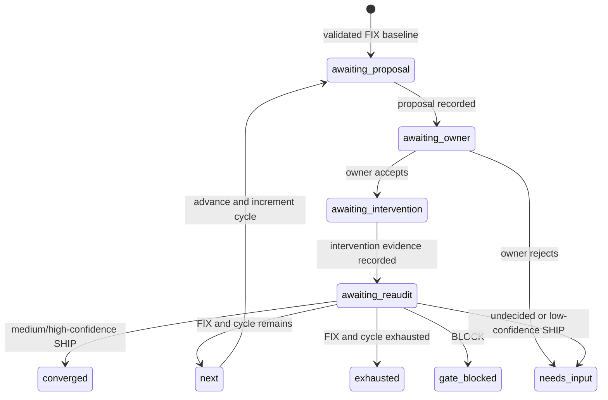

# Proposal-only audit loop protocol v2

The audit loop turns a validated `FIX` gate result into a bounded sequence of
proposals, owner actions, and independent re-audits. It is an **operational
coordination record**, not an autonomous repair engine and not a truth registry.
The runtime never executes a proposed change, never contacts an owner, and never
authorizes an external mutation.

## Entry and terminal rules

A loop can start only from an exact, validator-clean auditor artifact with:

- `status: DONE_WITH_CONCERNS`
- `verdict: FIX`
- `score_state: SCORED`

The baseline bytes are hashed after a no-follow, single-link read and the exact
bytes are revalidated. The loop records framework, profile, target, observation
date, catalog, typed-context hash, evidence coverage, confidence, and scores. A
re-audit must have different bytes and the same framework/profile/target
identity. Its `observed_at` must be strictly later than the baseline observation
date and no earlier than the intervention step's UTC calendar date; this is a
conservative provenance floor for the audit artifact's day-level timestamp, not
proof that the intervention caused the result. Context is allowed to change and
its new hash is retained.

The referenced run must already exist. Starting a loop or appending any new
transition/event requires it to remain non-terminal; a missing or sealed run is
rejected before a new loop directory is created. The only sealed-run exception
is the materialization-only repair of an exact event anchor that was already
durable before the terminal event, described below.

Only `DONE + SHIP + SCORED` with **medium or high** aggregate confidence enters
`converged`. A low-confidence SHIP enters `needs-input`; `FIX` enters `next` or
`exhausted`; `BLOCK` enters `gate-blocked`; an undecided audit enters
`needs-input`.



Owner review is a typed `accept` or `reject` decision. Both outcomes preserve
the responsible owner identity; rejection terminates in `needs-input` without
executing the proposal.

Proposal and intervention references must bind non-empty exact bytes. The
recorded owner/actor is attribution only: neither a non-empty file nor an owner
label proves authorization, execution quality, or causal effect.

The configured cycle count is 1–3. Retries are counted separately and never
consume a cycle. Retry backoff is deterministic (`1, 2, 4, 8, 16, 32` seconds,
capped at 32); the runtime records `retry_not_before` and returns immediately—it
does not sleep. Crossing the loop deadline or retry budget enters `exhausted`;
`reason_code` distinguishes `deadline-expired` from `retry-budget-exhausted`.

## Immutable state and concurrency

Each transition is a JSON document conforming to
[`audit-loop-state.schema.json`](audit-loop-state.schema.json), stored as:

```text
memory/runs/<run-id>/loops/<loop-id>/<sequence>-<transition>.json
```

Directories are mode `0700`; step files and the short-lived lock file are mode
`0600`. The runtime refuses symlinks, hard links, unsafe residue, non-contiguous
steps, invalid UUID5 transition identities, and a broken previous-step SHA-256
chain. Step occurrence times are monotonic, and terminal states accept no
successor even after their deadline. The stream is capped at 128 steps and the
final step is reserved for a terminal transition (`converged`, `exhausted`,
`needs-input`, `gate-blocked`): a non-terminal transition is refused once 127
steps exist, so a loop that has burned its budget on leases, retries, or
proposal cycles can never be stranded active — once the deadline passes, any
action records the forced `deadline-expired` step and the loop always remains
sealable; a full-length chain that does not end in a terminal state is rejected
on read. Every document is size-checked before installation. A safe leftover from an
interrupted immutable install is reclaimed before retrying the same request.
Each v2 document also binds the exact selected run parent through
`run_parent_event_id` and `run_parent_event_sha256`; a step cannot be moved to a
sibling event branch and remain valid.

Every mutation supplies:

- an idempotency key, whose request hash is retained;
- the expected previous step SHA-256 for optimistic concurrency;
- an RFC 3339 occurrence time.

An identical idempotent retry returns the installed step. Reusing the key for
different content fails. Two writers starting from the same head cannot both
advance it: the loser gets an optimistic concurrency conflict.

Each transition is **event-first**. After deriving and size-checking the exact
v2 step bytes, the controller reserves one `loop_state_changed` event on the
selected run ancestry with that future step reference and SHA-256. Only after
that event is durable does it materialize the immutable step with exactly those
bytes. The controller holds the per-run coordinator and loop lock throughout,
using the lock order coordinator → loop → run stream. Ordinary event appends,
hook events, snapshots, save points, and envelopes use the same coordinator, so
none can interleave inside this commit sequence.

If event reservation succeeds but step materialization fails, the error reports
`event_committed=true`. The event is the trust anchor, but the loop remains
unreadable until the file exists. Recovery must replay the **same original
request**: same idempotency key, occurrence time, expected head, and exact
inputs. The controller re-derives the same bytes and materializes them only when
their reference and hash match the reserved event. A different request, a
hand-edited file, or a public run-event command cannot complete the transition.
This file-only recovery may complete an exact durable anchor on a historical
sibling ancestry without appending an event or changing the selected head. It
may also run after the run has been sealed, provided the exact anchor precedes
the terminal event; terminal state still forbids every new transition or event.
The repair does not rewrite the terminal envelope, so a `loop_closure` recorded
as unresolved at seal time remains the preserved closure. An unanchored step
file is never committed loop state.

The event stream always reserves its final capacity slot for a terminal run
event. A new loop event, ordinary event, snapshot, save point, or waiting
envelope is refused before it could consume that slot; the run can still be
sealed as succeeded, failed, or aborted.

Loop coverage is branch-scoped. A new transition must extend the currently
selected ancestry, and one `loop_id` cannot fork across run branches. A
sibling-only loop is excluded from the selected branch's closure and does not
block sealing that branch. After a step exists, deduplicating it or continuing
that sibling loop requires selecting its anchored ancestry; the missing-step
recovery exception above only fills bytes already named by a durable event.
Historical event-bound branches remain readable, but selecting one branch does
not import another branch's loop tail.

## Short leases and fencing

Call `acquire-lease` before each state-changing action. Lease TTL is bounded to
30–900 seconds. Every acquisition increments a generation; an expired
generation can be replaced, while its old token remains fenced. Tokens are never
written to disk—only SHA-256 digests are retained. The business transition
releases the lease in the same immutable step, so no lease or OS file lock is
held while the loop waits for a proposal, owner, intervention, or re-audit.

## CLI outline

All writes require `--run-id`, `--loop-id`, `--idempotency-key`, and
`--expected-previous-sha256`, plus an explicit, replay-stable `--occurred-at`.
Artifact/evidence inputs also require their exact SHA-256 digest. The runtime
never fills the occurrence time from its wall clock because doing so would make
an otherwise identical idempotent recovery produce different request bytes.

```bash
python3 scripts/audit-loop.py start \
  --run-id "$RUN_ID" --loop-id "$LOOP_ID" \
  --idempotency-key start-1 --expected-previous-sha256 "$ZERO_SHA" \
  --occurred-at 2026-07-19T10:00:00Z \
  --audit-ref memory/audits/content/2026-07-19.md --audit-sha256 "$AUDIT_SHA" \
  --deadline 2026-07-20T00:00:00Z --max-cycles 3 --max-retries 2

python3 scripts/audit-loop.py acquire-lease \
  --run-id "$RUN_ID" --loop-id "$LOOP_ID" \
  --idempotency-key lease-proposal-1 --expected-previous-sha256 "$HEAD_SHA" \
  --occurred-at 2026-07-19T10:01:00Z \
  --lease-owner workflow-host --lease-token "$OPAQUE_TOKEN" --lease-ttl 60

python3 scripts/audit-loop.py proposal \
  --run-id "$RUN_ID" --loop-id "$LOOP_ID" \
  --idempotency-key proposal-1 --expected-previous-sha256 "$HEAD_SHA" \
  --occurred-at 2026-07-19T10:02:00Z \
  --lease-generation 1 --lease-token "$OPAQUE_TOKEN" \
  --proposal-ref memory/runs/records/proposal.json --proposal-sha256 "$PROPOSAL_SHA"
```

The remaining actions are `owner --decision accept|reject`, `intervention`, `reaudit`, `advance`,
`retry`, and the read-only `show`. `intervention` records evidence supplied by
the responsible owner; it does not perform that intervention. Every step fixes
`proposal_only: true` and `external_mutation_authorized: false`.

Python integrations use `apply_action(action, **options)` for a mutation,
`read_loop(root, run_id, loop_id)` or
`read_loop_with_event_coverage(root, run_id, loop_id)` for the same atomic,
event-bound ordered step view, and
`resolve_loop_step(root, run_id, loop_id, ref, sha256)` to resolve one exact
already event-bound step after validating the complete chain. A reserved event
whose step is missing is recovered only by replaying the original action with
the same idempotency key, exact `occurred_at`, expected head, and inputs so the
controller can re-derive the anchored bytes. `run-events.py loop-step <run-id>
<loop-id> <ref> <sha256>` is verification-only: it accepts an already
event-bound head for dedupe/projection checks and cannot create an anchor,
materialize a missing step, or create another transition.

## Run-envelope closure

`run-events.py finish` derives `loop_closure` from loop events on the envelope's
selected ancestry; caller-supplied closure claims are discarded. The bounded
record names the selected head and, for each selected loop, its last event,
expected step reference/hash, and validation result. Sibling-only loop events
and loop directories are outside that closure.

- `succeeded` requires exact event/step coverage and a terminal state for every
  selected loop.
- `waiting`, `needs-input`, and `blocked` require exact coverage, but selected
  loops may remain active.
- `failed` and `aborted` may seal with a bounded `unresolved` closure when a
  selected loop is nonterminal, missing, corrupt, mismatched, over budget, or
  times out during validation. This is an escape hatch for preserving failure
  evidence, not a claim that the loop converged or that its state is valid.

Only failed/aborted envelopes may also use the degraded no-context form; doing
so requires `route: null`, `save_point: null`, and all seven registry offsets
to be `null` rather than inventing unobserved context. Successful closure never
degrades.
